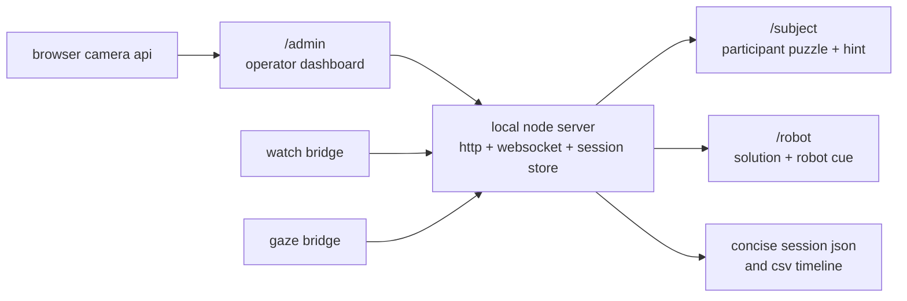
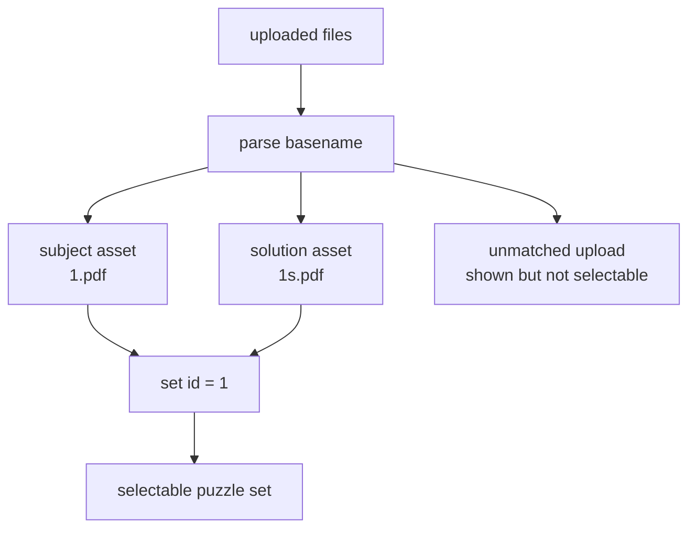
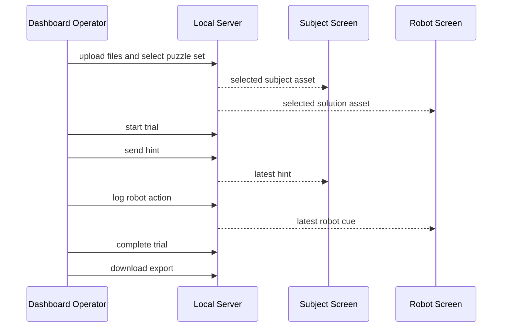

# Wizard of Oz Control Application Architecture

## Summary

The system is a local Node.js web server that coordinates one operator dashboard and two secondary screens over the same network.



The operator dashboard is the only control surface. The other two screens are read-only displays.

## Screen responsibilities

### `/admin`

- starts and stops the live camera preview
- optionally records metadata such as study ID and participant ID
- uploads puzzle files and chooses one logical puzzle set
- starts, completes, and resets the trial
- broadcasts hints to the participant
- broadcasts robot cues to the robot operator
- downloads the session JSON and CSV exports

### `/subject`

- shows the chosen subject puzzle file
- shows the latest hint from the dashboard
- updates live over WebSockets with no refresh

### `/robot`

- shows the paired solution file for the chosen puzzle set
- shows the latest robot cue from the dashboard
- updates live over WebSockets with no refresh

### `/audit`

- compatibility redirect to `/robot`

## Puzzle pairing model

The app groups uploads into puzzle sets using the filename suffix convention.



Rules:

- a subject asset is a file whose basename does not end in `s`
- a solution asset is a file whose basename ends in `s`
- `1.pdf` pairs with `1s.pdf`
- only complete pairs become selectable sets
- unmatched uploads stay visible in the dashboard as incomplete files

## State model

The session holds one selected puzzle set for the current run.

```json
{
  "session": {
    "id": "session-20260413-120000",
    "status": "running",
    "trialStartedAt": "2026-04-13T12:03:00.000Z",
    "completedAt": null,
    "metadata": {
      "studyId": "pilot-01",
      "participantId": "P-001",
      "condition": "adaptive",
      "researcher": "shrijak",
      "notes": "pilot run"
    },
    "puzzleSet": {
      "setId": "1",
      "label": "1",
      "subjectAsset": {
        "originalName": "1.pdf",
        "urlPath": "/media/puzzles/subject-file.pdf"
      },
      "solutionAsset": {
        "originalName": "1s.pdf",
        "urlPath": "/media/puzzles/solution-file.pdf"
      }
    }
  },
  "hint": {
    "text": "try the outer edge first",
    "updatedAt": "2026-04-13T12:07:10.000Z"
  },
  "robotAction": {
    "actionId": "function-3",
    "label": "Function 3: Blue Triangle",
    "updatedAt": "2026-04-13T12:09:55.000Z"
  }
}
```

The backend still stores telemetry and adaptive state, but those are no longer part of the main operator workflow or the primary export.

## Data flow



## Routes and APIs

### Pages

- `GET /admin`
- `GET /subject`
- `GET /robot`
- `GET /audit`

### State and mutation APIs

- `GET /api/state`
- `GET /api/events?limit=N`
- `POST /api/session/configure`
- `POST /api/session/start`
- `POST /api/session/complete`
- `POST /api/session/reset`
- `POST /api/puzzles/upload`
- `POST /api/puzzles/select`
- `POST /api/hints`
- `POST /api/actions`

### Export APIs

- `GET /api/export/current.json`
- `GET /api/export/current.csv`

### Optional integration APIs

- `POST /api/telemetry/hrv`
- `POST /api/telemetry/gaze`
- `POST /api/bridge/gaze/heartbeat`
- `POST /api/bridge/gaze/frame`

## Export format

The primary export is intentionally concise and operator-facing.

```json
{
  "sessionId": "session-20260413-120000",
  "startedAt": "2026-04-13T12:00:00.000Z",
  "trialStartedAt": "2026-04-13T12:03:00.000Z",
  "completedAt": "2026-04-13T12:18:42.000Z",
  "durationSeconds": 942,
  "metadata": {
    "studyId": "pilot-01",
    "participantId": "P-001",
    "researcher": "shrijak",
    "notes": "pilot run"
  },
  "puzzle": {
    "setId": "1",
    "subjectFile": "1.pdf",
    "solutionFile": "1s.pdf"
  },
  "interventions": [
    {
      "timestamp": "2026-04-13T12:07:10.000Z",
      "type": "hint",
      "text": "try the outer edge first"
    },
    {
      "timestamp": "2026-04-13T12:09:55.000Z",
      "type": "robot",
      "actionId": "function-3",
      "label": "Function 3: Blue Triangle"
    }
  ]
}
```

The CSV remains available as a raw timeline for downstream analysis.
