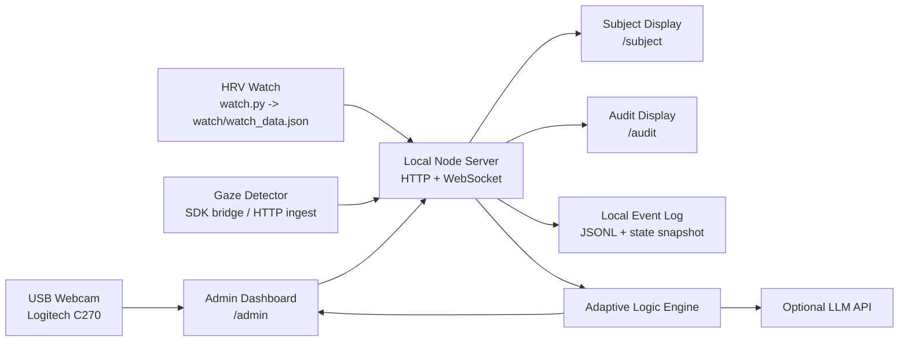
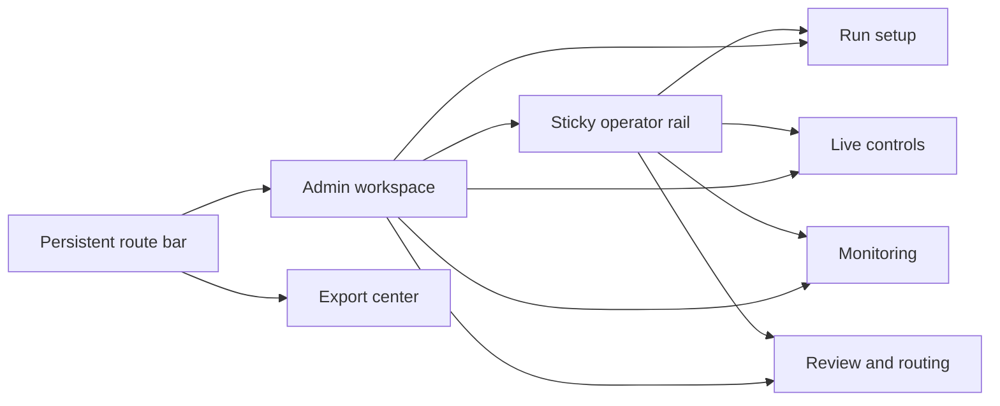
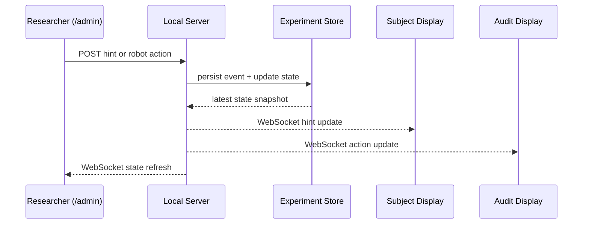
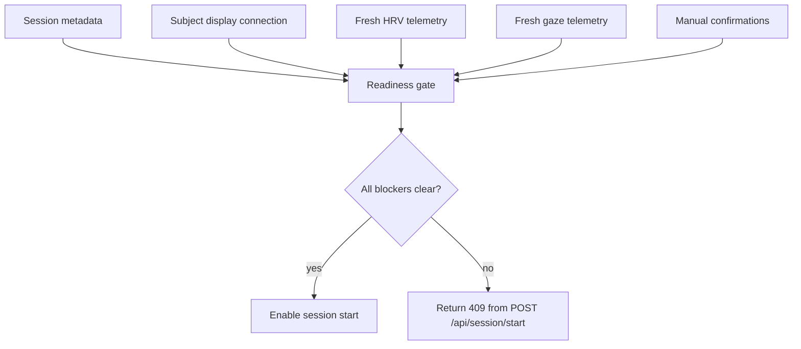
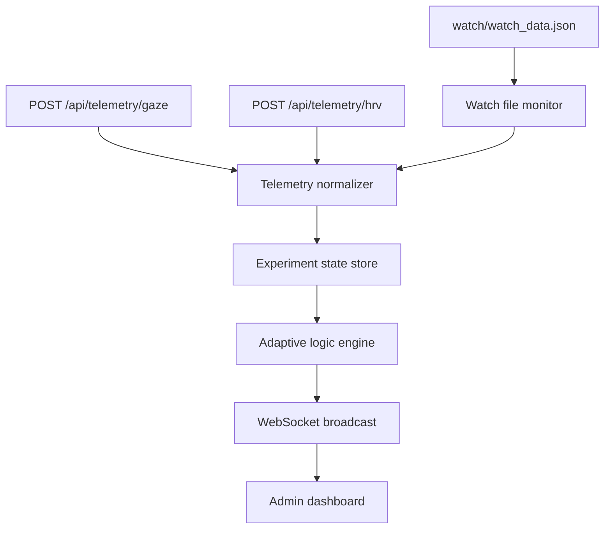
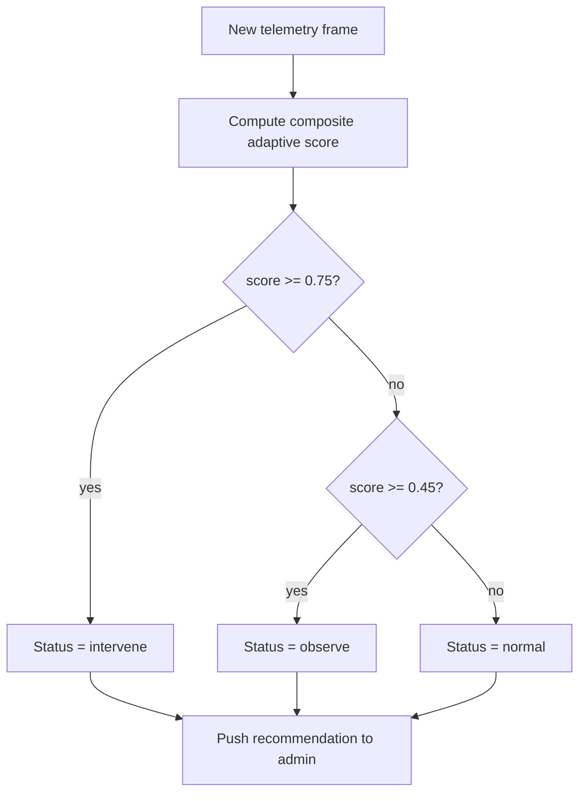
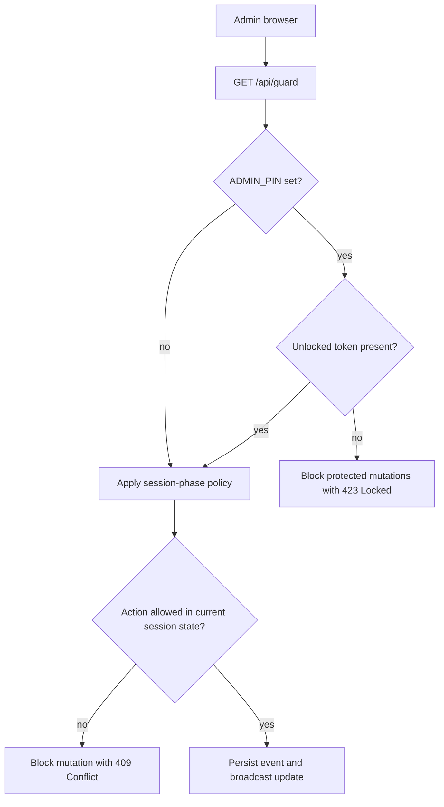

# Wizard of Oz Control Application Architecture

## Goals

The application coordinates a live Wizard of Oz research session from one host machine while keeping the participant and audit screens synchronized in real time. It must:

- surface live camera and telemetry to the researcher
- decide when adaptive interventions are warranted
- broadcast hints to a participant-facing display
- log manual robotic arm actions and broadcast them to an audit display
- write a trustworthy experiment timeline for later analysis

## System topology



## Component responsibilities

### 1. Local HTTP server

- Serves the three route-specific frontends
- Exposes REST endpoints for telemetry ingest, interventions, actions, and state
- Hosts the WebSocket hub used by all displays

### 2. WebSocket hub

- Maintains active clients grouped by screen role
- Pushes state snapshots and incremental events without page refreshes
- Broadcasts hint updates to subject screens and action updates to audit screens

### 3. Experiment state store

- Keeps the latest state in memory for fast UI refresh
- Persists snapshots and timeline events to disk
- Tracks the latest hint, latest robotic action, adaptive status, and telemetry summaries
- Persists manual before-participant acknowledgements so study-day setup becomes part of the export record

### 4. Telemetry ingestion layer

- Accepts HTTP posts from gaze or other sensor bridges
- Watches the HRV watch output JSON file written by `watch.py`
- Normalizes metrics into one internal telemetry model
- Tracks gaze-bridge heartbeat and last-frame diagnostics for the admin UI
- Derives sensor-health summaries so stale or missing streams surface clearly to the operator

### 5. Adaptive logic engine

- Evaluates recent HRV and gaze conditions
- Produces a recommendation state: `normal`, `observe`, or `intervene`
- Uses heuristics by default and can optionally call an LLM adapter for narrative guidance
- Persists per-session thresholds, weights, and freshness timing so a study can tune sensitivity without code changes

### 6. Frontend route views

- `admin`: dense operational UI for the researcher
- `subject`: distraction-free hint panel
- `audit`: large-format robotic action monitor
- `exports`: session analytics, download center, and replay timeline
- `admin` also exposes the operator safeguard board plus the before-participant gate with live readiness blockers

## Operator information architecture



## Data flow



## Before-participant gate



## Telemetry flow



## Route map

- `GET /admin`: main operator interface
- `GET /subject`: participant hint terminal
- `GET /audit`: robot action audit display
- `GET /exports`: session export center
- `GET /api/state`: full current experiment state
- `GET /api/events?limit=N`: recent event timeline
- `GET /api/exports`: session export manifest
- `GET /api/exports/current.bundle.json`: current session bundle export
- `GET /api/exports/current.csv`: current session timeline CSV
- `GET /api/bridge/gaze`: current gaze-bridge status
- `GET /api/guard`: current operator safeguard state and action policy matrix
- `GET /api/preflight`: current before-participant gate summary
- `GET /health`: server and sensor-health summary for launcher checks and operator diagnostics
- `POST /api/hints`: create and broadcast a participant hint
- `POST /api/actions`: create and broadcast a robotic arm action event
- `POST /api/adaptive/config`: update the adaptive rule set for the current session
- `POST /api/preflight/acknowledgements`: save manual before-participant confirmations
- `POST /api/telemetry/hrv`: ingest HRV metrics from a bridge or simulator
- `POST /api/telemetry/gaze`: ingest gaze metrics from a bridge or simulator
- `POST /api/telemetry/simulate`: push a combined mock telemetry frame for demos/tests
- `POST /api/bridge/gaze/heartbeat`: update gaze-bridge status
- `POST /api/bridge/gaze/frame`: normalize and ingest a raw gaze-device frame
- `POST /api/guard/unlock`: exchange the local PIN for a browser-scoped admin token
- `POST /api/guard/lock`: invalidate the current browser token
- `POST /api/session/reset`: clear in-memory state and start a fresh experiment log

## Internal state shape

```json
{
  "session": {
    "id": "session-20260401-214800",
    "startedAt": "2026-04-01T21:48:00.000Z",
    "status": "running",
    "trialStartedAt": "2026-04-01T21:49:30.000Z",
    "completedAt": null,
    "metadata": {
      "studyId": "pilot-01",
      "participantId": "P-001",
      "condition": "adaptive",
      "researcher": "Primary Researcher",
      "notes": "Puzzle pieces pre-arranged."
    }
  },
  "hint": {
    "text": "Try matching the blue triangle to the outer corner.",
    "updatedAt": "2026-04-01T21:55:00.000Z"
  },
  "robotAction": {
    "actionId": "function-3",
    "label": "Blue Triangle",
    "updatedAt": "2026-04-01T21:55:08.000Z"
  },
  "telemetry": {
    "hrv": {},
    "gaze": {},
    "derived": {}
  },
  "adaptive": {
    "status": "observe",
    "score": 0.53,
    "reason": "HRV stress is elevated and focus loss is increasing."
  },
  "preflight": {
    "acknowledgements": {
      "cameraFramingChecked": true,
      "subjectDisplayChecked": true,
      "robotBoardReady": true,
      "materialsReset": true
    },
    "updatedAt": "2026-04-01T21:48:55.000Z",
    "updatedBy": "Primary Researcher"
  }
}
```

## Logging strategy

- `data/events.jsonl`: append-only experiment timeline
- `data/state.json`: current state snapshot for crash recovery
- `data/export/session-<id>.csv`: optional export-friendly timeline
- `GET /api/exports/<session-id>.bundle.json`: machine-readable state and event bundle

Every mutation must create a timestamped event with:

- event type
- actor or source
- machine-readable payload
- human-readable summary

Session configuration, start, and completion are logged alongside telemetry and intervention events so exports can reconstruct the full trial lifecycle.

The export bundle also derives:

- event counts by type
- session duration and latest intervention summaries
- replay steps with offsets from the first event
- the stored before-participant acknowledgements inside the exported session state

## Sensor integration plan

### HRV watch

The provided `watch.py` writes `watch/watch_data.json`. The server should monitor that file and ingest only new entries as they appear. This avoids coupling BLE logic to the web server process.

### Gaze detector

The gaze stack is SDK-dependent, so the server exposes a stable HTTP ingest contract. The repository now includes `integrations/gaze/bridge.py`, which can read SDK output from stdin or by tailing a JSONL file and then forward normalized frames into the app.

A normalized gaze frame can look like:

```json
{
  "attentionScore": 0.31,
  "fixationLoss": 0.68,
  "pupilDilation": 0.54,
  "source": "gaze-sdk"
}
```

The bridge also understands alias keys like `focus`, `attention`, `fixation_loss`, and `pupil`.

### Study-day launcher

The repository now includes `npm run launch:study` for experiment-day startup. The launcher starts the local server first, then brings up the watch process and the gaze bridge with a configurable mode such as `heartbeat-only`, `stdin-jsonl`, or `file-tail`.

Optional hardware-side processes are allowed to fail independently without taking down the main server, so the researcher can still recover or continue setup from the dashboard.

## Adaptive engine behavior



Inputs considered in the composite score:

- HRV stress score and distraction flag from the watch
- gaze attention loss and fixation instability
- recency weighting so stale telemetry cannot trigger interventions

The rule set is operator-tunable per session:

- observe and intervene thresholds
- HRV versus gaze weighting
- distraction boost
- freshness windows for how long telemetry remains actionable

## Operator safeguard flow



## Security and operational posture

- Meant for trusted local-network use during live studies
- No authentication is enforced by default for local setup simplicity
- `ADMIN_PIN` enables a lightweight local lock for browser-based admin mutations
- Unlock state is browser-scoped through short in-memory tokens rather than shared cookies
- Sensor and bridge ingest routes remain open so device streaming is not interrupted by the operator lock
- Session-phase protections are always enforced, even when the PIN lock is disabled
- All external API use is optional and disabled when keys are absent
- The server should remain functional offline except for optional LLM calls
