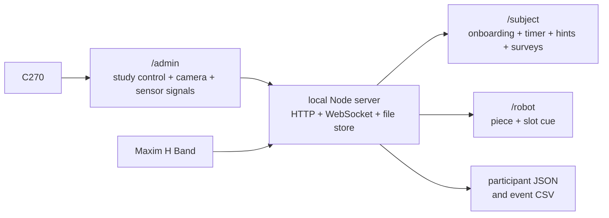

# Wizard of Oz Control Application Architecture

## Summary

The local Node.js server coordinates one researcher dashboard and two secondary screens over the same network. One persisted session represents one participant's complete nine-puzzle study.

```mermaid
flowchart LR
    admin["/admin<br/>study control + camera + sensor signals"] --> server["local Node server<br/>HTTP + WebSocket + file store"]
    server --> subject["/subject<br/>onboarding + timer + hints + surveys"]
    server --> robot["/robot<br/>piece + slot cue"]
    watch["Maxim H Band"] --> server
    camera["C270"] --> admin
    server --> export["participant JSON<br/>and event CSV"]
```

## Study and randomization model

- Participant IDs are auto-reserved as `P01`, `P02`, and so on. The persistent registry prevents reuse.
- The participant number selects one of the six permutations of control, constant intervention, and adaptive intervention. Sequential IDs distribute the orders evenly.
- The nine complete puzzle pairs are globally shuffled with a saved seed. Three consecutive shuffled puzzles are assigned to each sitting.
- The assigned condition is constant within a sitting. All rounds, sittings, surveys, interventions, and telemetry stay in one participant session.
- The next round is blocked until the preceding questionnaire is submitted. After rounds 3 and 6, the researcher must also begin the next sitting.

## Screen responsibilities

### `/admin`

- shows the participant ID, condition order, and randomized schedule
- saves the researcher demographic/consent copy and configurable round/reminder timing
- starts, pauses, resumes, and completes rounds and opens sittings 2 and 3
- shows the C270, solution, HRV, adaptive spike highlight, and constant reminder
- disables hints and robot movements in control rounds
- requests watch recalibration between rounds or sittings
- can skip a per-round survey only after recording a reason
- ends the study only after all nine rounds and questionnaires are complete

### `/subject`

- collects demographics, consent, instruction acknowledgement, and baseline expected efficacy under the auto-assigned ID
- displays a pause-aware countdown and distinct start, midpoint, end, hint, and robot-action sound patterns
- shows six workload questions after every round and four additional intervention questions outside control
- shows breaks after rounds 3 and 6, then the final helpfulness, efficacy, trust, automation-bias, and comment block

### `/robot`

- shows only the latest piece-and-slot cue
- plays a loud movement sound pattern and later reminder after browser audio is armed

## Puzzle pairing and start gate

The filename convention pairs `1.pdf` with `1s.pdf`, through `9.pdf` with `9s.pdf`. Only complete pairs enter the schedule; unmatched files remain visible as incomplete uploads.

`POST /api/session/start` requires saved researcher and participant IDs, nine scheduled pairs, matching participant/researcher profiles, armed subject and robot screens, live C270, and healthy calibrated watch telemetry.

## Main APIs

- Session: `POST /api/session/configure`, `/start`, `/resume-sitting`, `/complete`, `/reset`
- Rounds: `POST /api/rounds/start`, `/pause`, `/resume`, `/complete`
- Participant data: `POST /api/participant/profile`, `/api/surveys/round`, `/api/surveys/final`
- Researcher override: `POST /api/surveys/round/skip`
- Interventions: `POST /api/hints`, `/api/hints/clear`, `/api/actions`
- Watch: `POST /api/watch/calibrate`
- Exports: `GET /api/export/current.json`, `/api/export/current.csv`

## Persistence and export

`data/state.json` stores resumable current state. `data/events.jsonl` and per-session CSV files retain the ordered audit trail. `data/participant-registry.json` prevents ID reuse across resets.

The main JSON export includes both profile copies, condition order, randomization seed, schedule, pause-aware round durations, interventions, every round survey or documented skip, the final survey, and recording metadata.
