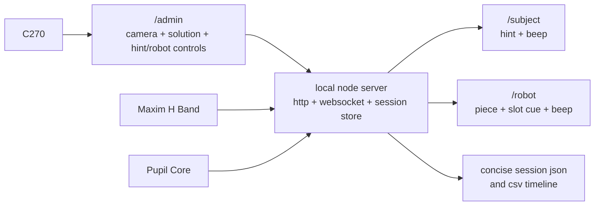
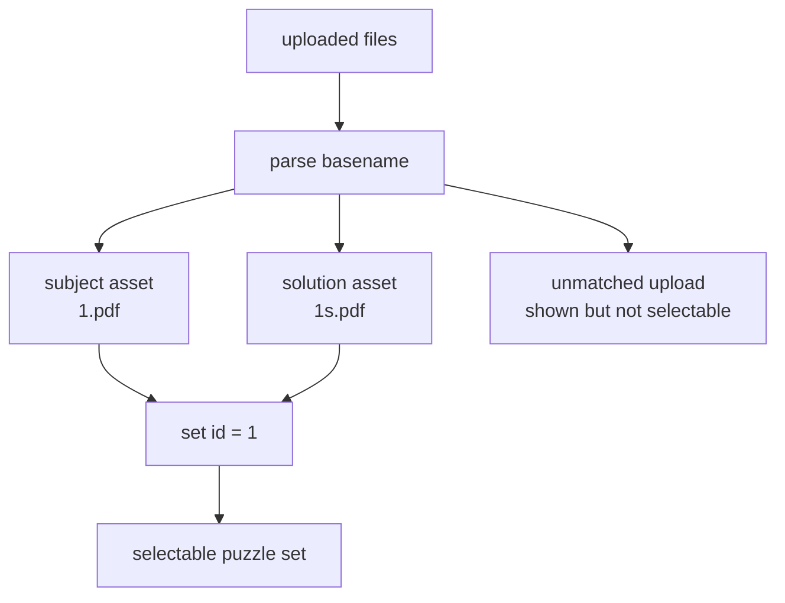
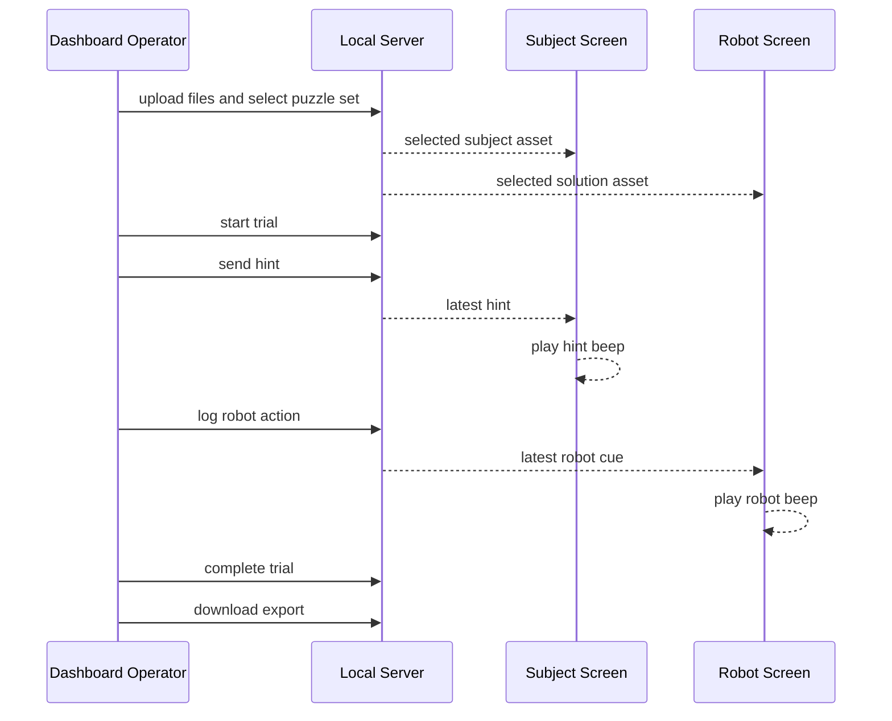

# Wizard of Oz Control Application Architecture

## Summary

The system is a local Node.js web server that coordinates one operator dashboard and two secondary screens over the same network.


```mermaid
flowchart LR
    admin["/admin<br/>camera + solution + hint/robot controls"] --> server["local node server<br/>http + websocket + session store"]
    server --> subject["/subject<br/>hint + beep"]
    server --> robot["/robot<br/>piece + slot cue + beep"]
    watch["Maxim H Band"] --> server
    gaze["Pupil Core"] --> server
    camera["C270"] --> admin
    server --> export["concise session json<br/>and csv timeline"]
```

The operator dashboard is the only control surface. The other two screens are read-only displays.

## Screen responsibilities

### `/admin`

- starts and stops the live C270 preview before the sitting can begin
- shows live HRV and Pupil gaze metrics
- records metadata such as study ID, participant ID, and sitting number
- auto-queues the three tangram pairs for that sitting; upload is a fallback
- starts the sitting, then starts and completes each round
- broadcasts hints to the participant
- broadcasts robot cues as piece + numbered slot
- downloads the session JSON and CSV exports

### `/subject`

- shows only the latest written hint from the dashboard
- does not receive the puzzle PDF; the physical tangram is on the table
- plays a short browser beep when a fresh hint arrives after the screen is armed
- updates live over WebSockets with no refresh

### `/robot`

- shows only the latest piece-and-slot cue from the dashboard
- does not receive the solution PDF; the operator keeps that on `/admin`
- plays a short browser beep when a fresh robot cue arrives after the screen is armed
- updates live over WebSockets with no refresh

### `/audit`

- compatibility redirect to `/robot`

## Puzzle pairing model

The app groups uploads into puzzle sets using the filename suffix convention.


```mermaid
flowchart TD
    upload["uploaded files"] --> parse["parse basename"]
    parse --> subject["subject asset<br/>1.pdf"]
    parse --> solution["solution asset<br/>1s.pdf"]
    subject --> pair["set id = 1"]
    solution --> pair
    pair --> dashboard["selectable puzzle set"]
    parse --> incomplete["unmatched upload<br/>shown but not selectable"]
```

Rules:

- a subject asset is a file whose basename does not end in `s`
- a solution asset is a file whose basename ends in `s`
- `1.pdf` pairs with `1s.pdf`
- only complete pairs become selectable sets
- unmatched uploads stay visible in the dashboard as incomplete files
- saving sitting 1/2/3 auto-queues puzzles 1–3 / 4–6 / 7–9 from `tangram puzzles/`

`POST /api/session/start` is denied unless preflight `requiredReady` is true: sitting profile, sitting queue, subject and robot screens armed, C270 live, watch sample, and a recent Pupil gaze frame.

## State model

The session holds a queue of puzzle sets for one sitting, plus the finished rounds and the active round. `puzzleSet` is the currently displayed pair (the active round).

```json
{
  "session": {
    "id": "session-20260413-120000",
    "status": "running",
    "trialStartedAt": "2026-04-13T12:03:00.000Z",
    "completedAt": null,
    "metadata": {
      "studyId": "pilot-01",
      "participantId": "P-001",
      "condition": "adaptive",
      "researcher": "shrijak",
      "notes": "pilot run"
    },
    "puzzleSet": {
      "setId": "1",
      "label": "1",
      "subjectAsset": {
        "originalName": "1.pdf",
        "urlPath": "/media/puzzles/subject-file.pdf"
      },
      "solutionAsset": {
        "originalName": "1s.pdf",
        "urlPath": "/media/puzzles/solution-file.pdf"
      }
    }
  },
  "hint": {
    "text": "try the outer edge first",
    "updatedAt": "2026-04-13T12:07:10.000Z"
  },
  "robotAction": {
    "actionId": "function-3",
    "label": "Function 3: Purple Triangle",
    "updatedAt": "2026-04-13T12:09:55.000Z"
  }
}
```

The backend still stores telemetry and adaptive state, but those are no longer part of the main operator workflow or the primary export.

## Data flow


```mermaid
sequenceDiagram
    participant Admin as Dashboard Operator
    participant Server as Local Server
    participant Subject as Subject Screen
    participant Robot as Robot Screen

    Admin->>Server: upload files and select puzzle set
    Server-->>Subject: selected subject asset
    Server-->>Robot: selected solution asset
    Admin->>Server: start trial
    Admin->>Server: send hint
    Server-->>Subject: latest hint
    Subject-->>Subject: play hint beep
    Admin->>Server: log robot action
    Server-->>Robot: latest robot cue
    Robot-->>Robot: play robot beep
    Admin->>Server: complete trial
    Admin->>Server: download export
```

## Routes and APIs

### Pages

- `GET /admin`
- `GET /subject`
- `GET /robot`
- `GET /audit`

### State and mutation APIs

- `GET /api/state`
- `GET /api/events?limit=N`
- `POST /api/session/configure`
- `POST /api/session/start`
- `POST /api/session/complete`
- `POST /api/session/reset`
- `POST /api/puzzles/upload`
- `POST /api/rounds/queue`
- `POST /api/hints`
- `POST /api/actions`
- `POST /api/camera/status`
- `POST /api/screens/ready`

### Export APIs

- `GET /api/export/current.json`
- `GET /api/export/current.csv`

### Optional integration APIs

- `POST /api/telemetry/hrv`
- `POST /api/telemetry/gaze`
- `POST /api/bridge/gaze/heartbeat`
- `POST /api/bridge/gaze/frame`

## Export format

The primary export is intentionally concise and operator-facing.

```json
{
  "sessionId": "session-20260413-120000",
  "startedAt": "2026-04-13T12:00:00.000Z",
  "trialStartedAt": "2026-04-13T12:03:00.000Z",
  "completedAt": "2026-04-13T12:18:42.000Z",
  "durationSeconds": 942,
  "metadata": {
    "studyId": "pilot-01",
    "participantId": "P-001",
    "researcher": "shrijak",
    "notes": "pilot run"
  },
  "puzzle": {
    "setId": "1",
    "subjectFile": "1.pdf",
    "solutionFile": "1s.pdf"
  },
  "interventions": [
    {
      "timestamp": "2026-04-13T12:07:10.000Z",
      "type": "hint",
      "text": "try the outer edge first"
    },
    {
      "timestamp": "2026-04-13T12:09:55.000Z",
      "type": "robot",
      "actionId": "function-3",
      "label": "Function 3: Purple Triangle"
    }
  ]
}
```

The CSV remains available as a raw timeline for downstream analysis.
