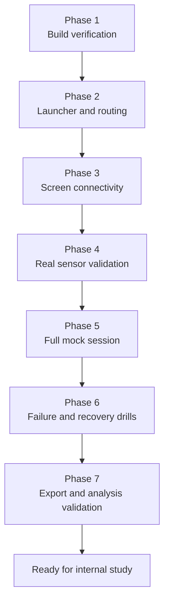
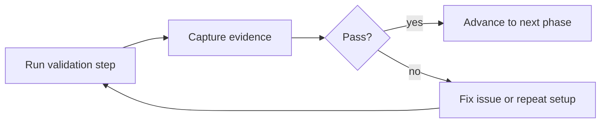

# End-To-End Validation Plan

## Purpose

This plan turns internal-study validation into a repeatable ladder instead of a vague rehearsal. Each phase has:

- a clear goal
- exact actions to perform
- pass criteria
- evidence to capture

Do not advance to the next phase until the current one passes cleanly.

## Validation ladder

## Phase map

| Phase | Goal | Required outcome |
| --- | --- | --- |
| 1 | Verify the build and local checks | `npm run verify` passes |
| 2 | Verify startup flow | launcher brings the stack up cleanly |
| 3 | Verify multi-screen routing | `/admin`, `/subject`, `/audit`, `/exports` all load and reconnect |
| 4 | Verify real hardware inputs | watch and gaze feeds appear and stale warnings behave correctly |
| 5 | Verify a full mock study run | metadata, readiness gate, hints, robot actions, adaptive flow, and completion all work in sequence |
| 6 | Verify recovery behavior | disconnects, refreshes, and resets behave predictably |
| 7 | Verify analysis artifacts | bundle and CSV contain all study-critical information |

## Validation flow

## Phase 1. Build verification

### Goal

Confirm the repo is in a clean, reproducible state before touching hardware.

### Actions

1. Run `npm run verify`.
2. Confirm the command exits successfully.
3. Record the date, branch, and commit in the dry-run log.

### Pass criteria

- Node tests pass
- Python bridge syntax checks pass
- no manual file edits are needed to make the build green

### Evidence

- command run: `npm run verify`
- commit hash used for the rehearsal
- whether any warnings need follow-up

## Phase 2. Launcher and routing

### Goal

Confirm study-day startup is boring and repeatable on the host machine.

### Actions

1. Run `ADMIN_PIN=1357 npm run launch:study`.
2. Wait for the server to announce the admin URL.
3. Open `http://localhost:3000/admin`.
4. Confirm `/health` responds.

### Pass criteria

- launcher starts without manual retries
- admin loads on the host machine
- health endpoint returns without crashing the stack

### Evidence

- launcher command used
- whether any optional bridge was disabled
- health summary at launch time

## Phase 3. Screen connectivity

### Goal

Confirm the multi-device routing works exactly as it will during the study.

### Actions

1. Open `/subject` on the participant device.
2. Open `/audit` on the audit device if you are using one.
3. Open `/exports` on the host.
4. Refresh each page once.

### Pass criteria

- all pages load
- admin shows connection counts correctly
- subject and audit reconnect after refresh
- no page requires a server restart after reconnecting

### Evidence

- device names used
- host IP used
- whether reconnect behavior was clean

## Phase 4. Real sensor validation

### Goal

Confirm the real watch and gaze setup produce live data and predictable health warnings.

### Actions

1. Start the watch flow.
2. Start the gaze flow.
3. Confirm HRV metrics appear on `/admin`.
4. Confirm gaze metrics appear on `/admin`.
5. Intentionally pause one stream and watch for a stale warning.
6. Restore the stream and confirm recovery.

### Pass criteria

- real HRV data appears without simulation
- real gaze data appears without simulation
- sensor health warns when a stream goes stale
- sensor health recovers after the stream resumes

### Evidence

- watch source label shown in the UI
- gaze source label shown in the UI
- stale warning behavior for each bridge

## Phase 5. Full mock session

### Goal

Confirm the actual researcher workflow works start to finish.

### Actions

1. Save session metadata.
2. Clear the before-participant gate.
3. Start the session.
4. Send at least two hints.
5. Log at least two robot actions.
6. Confirm adaptive status changes using real or simulated telemetry.
7. Confirm the live puzzle timer is advancing during the run.
8. Mark the session complete and note the final completion duration.

### Pass criteria

- no restart is required during the run
- live controls work only when they should
- state transitions happen in the correct order
- the live puzzle timer advances during the active run
- the session completes cleanly

### Evidence

- participant ID used in the mock run
- hint text samples used
- robot actions logged
- adaptive status transitions observed
- final puzzle duration shown in the operator UI

## Phase 6. Failure and recovery drills

### Goal

Confirm the system fails clearly and recovers safely under expected lab mistakes.

### Actions

1. Refresh `/admin` during a run.
2. Refresh `/subject` during a run.
3. Disconnect and reconnect the gaze source.
4. Disconnect and reconnect the watch source.
5. Trigger a forced reset during a running session.
6. Lock and unlock the admin browser again.

### Pass criteria

- reconnects restore expected state
- stale warnings are accurate
- force reset starts a clean new session
- operator lock rules still hold after recovery

### Evidence

- which failure cases were tested
- whether recovery was automatic or manual
- any confusing operator behavior that should be documented

## Phase 7. Export and analysis validation

### Goal

Confirm the study produces complete analysis artifacts.

### Actions

1. Download the current bundle JSON.
2. Download the current CSV timeline.
3. Inspect the export center analytics and replay timeline.
4. Confirm the bundle contains the required study fields.

### Required fields

- study metadata
- participant ID and condition
- preflight acknowledgements
- hints sent
- robot actions logged
- telemetry events
- adaptive configuration
- trial start event
- trial completion event
- puzzle completion duration
- completion summary

### Pass criteria

- bundle contains all required fields
- CSV is readable and ordered
- replay timeline matches the observed session order

### Evidence

- export filenames reviewed
- missing fields, if any
- whether the artifacts are analysis-ready without manual reconstruction

## Sign-off rule

The system is ready for the internal study only after:

1. two consecutive clean full mock sessions
2. one successful failure-recovery drill pass
3. one export bundle reviewed end to end and judged analysis-ready
