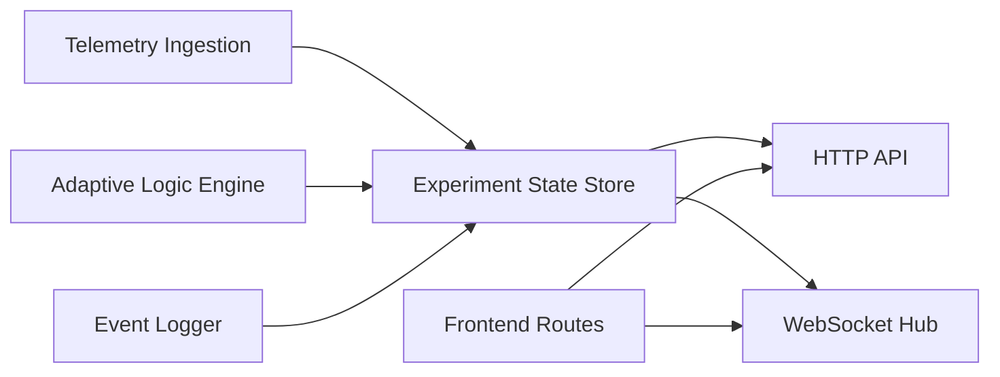

# Implementation Plan And Traceability

## Working assumptions

- The app runs on the researcher's machine on a trusted LAN.
- The browser will handle webcam preview directly through `getUserMedia`.
- The HRV watch collector remains a separate Python process and writes `watch/watch_data.json`.
- The gaze system may vary, so we provide a stable HTTP ingest endpoint instead of hard-coding a vendor SDK.
- Optional LLM-based reasoning is additive; heuristic logic remains the guaranteed baseline.

## Dependency graph

## Traceable task list

| Task ID | Task | Depends On | Design Reference |
| --- | --- | --- | --- |
| T1 | Initialize repo, runtime metadata, and file layout | None | Architecture: System topology |
| T2 | Build file-backed experiment state store and event logger | T1 | Architecture: Logging strategy |
| T3 | Implement WebSocket hub and route-aware broadcasting | T2 | Architecture: Component responsibilities |
| T4 | Implement HTTP API for hints, actions, telemetry, and session reset | T2 | Architecture: Route map |
| T5 | Implement adaptive logic engine with heuristic scoring | T2 | Architecture: Adaptive engine behavior |
| T6 | Implement watch file monitor and telemetry normalization | T2, T5 | Architecture: Sensor integration plan |
| T7 | Build admin dashboard UI | T3, T4, T5, T6 | Architecture: Frontend route views |
| T8 | Build subject and audit displays | T3, T4 | Architecture: Frontend route views |
| T9 | Add gaze bridge service, normalization, and operator diagnostics | T4, T6, T7 | Architecture: Sensor integration plan |
| T10 | Add export manifest, download routes, and export-center UI | T2, T4, T7 | Architecture: Logging strategy |
| T11 | Add automated tests for store, API, adaptive logic, and realtime flows | T2-T10 | Architecture: Data flow |
| T12 | Add operator docs and end-to-end runbook | T1-T11 | README + architecture docs |

## Delivery slices

### Slice 1

- Create repo metadata
- Add docs and execution plan
- Define data contracts

### Slice 2

- Build backend core: server, store, logger, adaptive engine
- Cover backend with automated tests

### Slice 3

- Build admin, subject, and audit frontends
- Wire browser actions to REST and WebSockets

### Slice 4

- Add watch integration, simulation tools, and runbook polish
- Verify end-to-end flows locally

### Slice 5

- Add gaze bridge heartbeat and raw-frame normalization
- Add session export center and downloadable artifacts
- Verify operator flows and update docs

### Slice 6

- Add session metadata capture for study, participant, and condition
- Add explicit setup, running, and completed trial states
- Include lifecycle data in exports and operator workflow

### Slice 7

- Derive export analytics from the ordered event log
- Add replay timeline browsing to the export center
- Verify analytics and replay output through tests

## Validation checklist

- Admin view loads and can preview the webcam
- Subject display updates without refresh when a hint is sent
- Audit display updates without refresh when a robotic action is logged
- Telemetry ingest updates charts and adaptive recommendation state
- Session metadata persists into state and export bundles
- Trial lifecycle transitions are logged with timestamps
- Export center shows analytics and replay timeline for a selected session
- Session events append to disk with timestamps
- Tests pass before any commit is created
