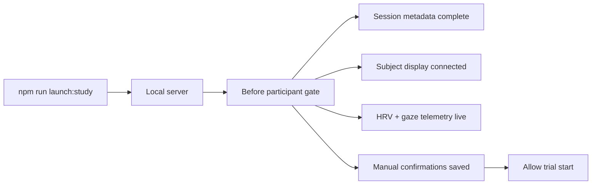
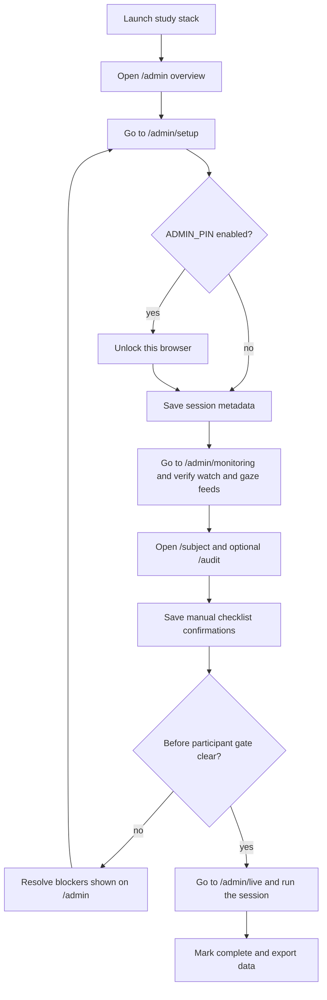

# Internal Study Readiness

## Purpose

This runbook is the shortest path from a clean laptop to a participant-ready internal study session. It is intentionally strict. The goal is to make experiment-day setup boring, repeatable, and easy to audit after the fact.

For the full rehearsal ladder and pass criteria, use [end-to-end-validation-plan.md](/Users/owlxshri/Downloads/hti/docs/end-to-end-validation-plan.md). For each rehearsal, duplicate and fill [dry-run-log-template.md](/Users/owlxshri/Downloads/hti/docs/dry-run-log-template.md).

## Readiness architecture

## Experiment-day flow

## Before first participant

1. Start the stack with `npm run launch:study`.
2. Open `/admin` on the host laptop, then move into `/admin/setup`.
3. Unlock the admin browser if `ADMIN_PIN` is enabled.
4. Save the session profile with `study id`, `participant id`, `condition`, and `researcher`.
5. Open `/subject` on the participant-facing device and confirm the admin screen shows the subject display as connected.
6. Open `/audit` on a secondary device if you want a separate robot-action monitor.
7. Confirm the watch bridge is live and at least one HRV sample has arrived.
8. Confirm the gaze bridge is live and at least one gaze sample has arrived.
9. Save all four manual checklist confirmations on the before-participant gate:
   camera framing checked
   subject display confirmed
   robot control board ready
   puzzle materials reset
10. Use `/admin/live` for hints and robot actions once the trial is running.
11. Start the trial only after the gate reports no blockers.

## Dry-run protocol

Run this before your first real participant and again after any network or hardware change.

1. Launch the stack.
2. Walk through the full gate until it reports ready.
3. Start a mock trial.
4. Send one hint and verify it appears on `/subject`.
5. Log one robot action and verify it appears on `/audit`.
6. Confirm the adaptive panel updates after fresh telemetry.
7. Confirm the live puzzle timer is advancing while the trial is running.
8. Complete the trial and note the final completion duration shown on `/admin/review` or `/exports`.
9. Download `current.bundle.json` and `current.csv` from `/exports`.
10. Confirm the bundle contains:
   session metadata
   preflight acknowledgements
   telemetry events
   adaptive configuration
   trial start and completion events
   puzzle completion duration

## Recovery rules

- If the subject display disconnects before start, reconnect it and wait for the gate to clear.
- If watch or gaze telemetry is stale before start, do not begin the participant run until the gate clears.
- If the trial is already running and telemetry goes stale, continue only if your protocol allows it and document the issue in the completion summary.
- If setup becomes confused, use `Reset session` during setup or `Force reset session` only when a live run must be aborted.

## What the gate enforces

The server-side readiness gate blocks `POST /api/session/start` until:

- study id, participant id, and researcher are present
- at least one subject display connection is active
- fresh HRV telemetry has been received
- fresh gaze telemetry has been received
- all four manual confirmations have been saved

The gate does not require `/audit`, but it will recommend opening it.
