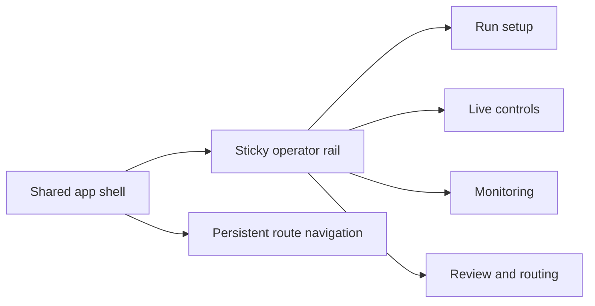
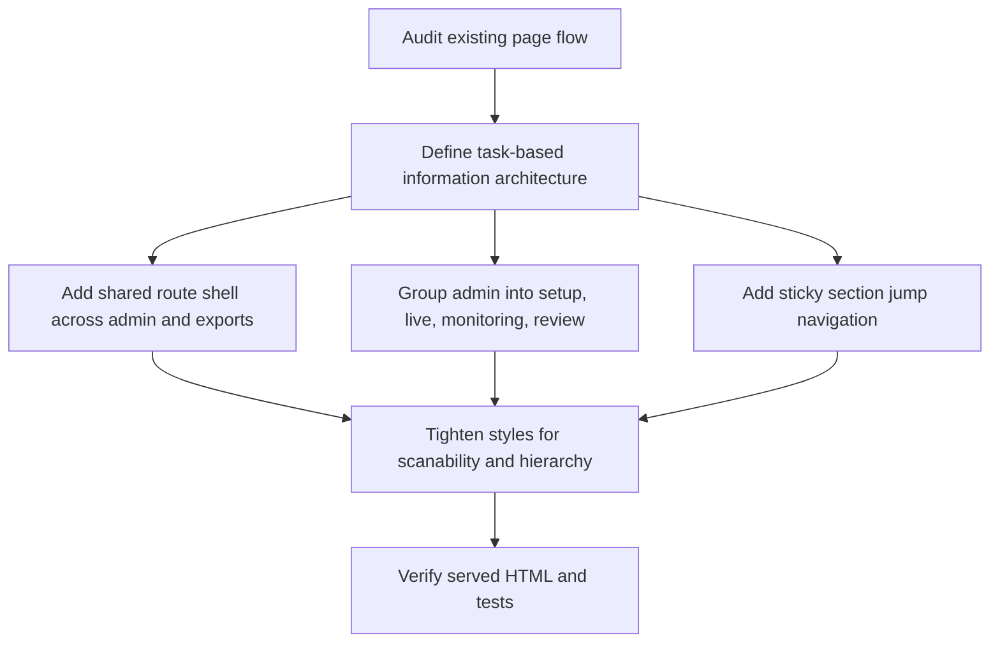

# Operator Navigation Audit

## Audit summary

The dashboard already exposes the right capabilities, but the page is still harder to scan than it should be during a live run. The biggest navigation issues are:

- the admin page reads like one long wall of panels instead of a task-based workspace
- high-frequency controls compete visually with setup, routing, and review utilities
- exports feel like a separate page instead of part of the same operator system
- operators do not have a persistent, glanceable jump map while moving through the session

## Target information architecture

## Traceable cleanup plan

## Planned operator workspaces

| Workspace | Primary job | Panels |
| --- | --- | --- |
| Run setup | Prepare the next participant safely | Session metadata, readiness gate, safeguards |
| Live controls | Act quickly during the run | Hint terminal, robot action log |
| Monitoring | Understand participant state | Camera, telemetry, sensor health, adaptive rules |
| Review and routing | Lower-frequency support tasks | Exports, network routing, simulator, event log |
