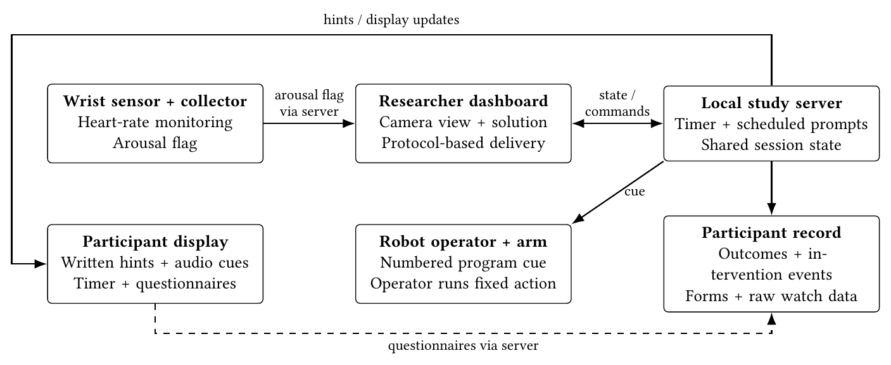

# When to Help: Scheduled and Physiology-Informed Assistance in Physical Tangram Solving

## Abstract

In human–robot interaction (HRI), deciding when to provide assistance requires understanding how different intervention strategies affect both task performance and the user experience. Previous work has compared physiology-triggered robotic assistance with periodic support in surgical training. We extend this work to physical spatial problem solving by conducting a within-participant experiment to compare three conditions: no assistance, scheduled assistance, and adaptive assistance based on physiological signals. Twenty-four participants (N = 24) solve nine physical tangram puzzles across three sessions. The order of the conditions is varied across participants, and puzzles are randomly assigned to the sessions. Tangrams combine spatial reasoning with physical manipulation, providing a simple task for studying informational and physical assistance. Participants receive on-screen hints and robotic-arm interventions through a Wizard-of-Oz setup, with assistance either scheduled or adapted using heart-rate signals and task progress. We evaluate puzzle completion, completion time, workload, helpfulness, intervention timing, frustration, and trust. Both assistance conditions improve completion rates compared with no assistance; scheduled assistance achieves the highest completion and shortest duration, while adaptive assistance receives higher helpfulness and timing ratings and lower frustration. Together, these findings highlight distinct trade-offs between assistance strategies in task performance and user experience, providing insights for designing HRI systems that adapt assistance to the needs of the user.

## 1. Introduction

A person solving a physical puzzle may pause to mentally rotate a piece, reconsider an arrangement, or decide what to try next. These moments can look similar to an observer but call for different responses. A hint may help someone resume work; the same hint during a productive pause may interrupt a solution they were about to reach. For an assistive robot, deciding when to act is therefore part of deciding how to help.

Recent human-robot collaboration research makes assistance contingent on the person's activity. Andriella et al. model assistance type, timing, and confidence [1], while PACE uses action-completion estimates to coordinate proactive assistance [4]. A recent review distinguishes adaptation of robot motion from task-level decisions about timing, sequencing, and role allocation [7]. These approaches raise an evaluation question: does a strategy that supports task execution also provide help that people experience as appropriate?

Physiological signals offer another basis for assistance timing. Yang et al. compared workload-adaptive robotic suction with periodic support during surgical training [15]. We extend this comparison to physical spatial problem solving, where a hint can change a person's understanding of an arrangement and robotic assistance can change the availability of a piece. Our focus is the relationship between task performance and the experience of receiving these interventions.

We use seven-piece tangram puzzles to study this relationship. Recent work uses tangrams for collaborative HRI and as a simplified assembly task [12, 9]. They support repeated attempts with common materials, observable completion outcomes, and both informational and physical assistance. We compare assistance offered at regular intervals with assistance offered when physiological monitoring flags arousal, allowing the timing policy to respond to changes during the task.

Each participant experiences no assistance, scheduled assistance, and adaptive assistance, with three different puzzles per condition. Scheduled assistance is offered every 30 seconds; adaptive assistance is offered whenever arousal is flagged. A Wizard-of-Oz setup delivers the corresponding hints and robot actions. We assess both puzzle performance and participant experience to understand how the two assistance policies support progress and how their interventions are received.

We address two research questions. **RQ1:** How do the three assistance conditions differ in puzzle completion and round duration? **RQ2:** How do they differ in perceived workload and frustration, and how do the assisted conditions compare in helpfulness and intervention timing?

Our contributions are:

1. A comparison of unassisted, scheduled, and physiology-informed assistance in physical spatial problem solving.
2. A Wizard-of-Oz platform coordinating text hints, robotic-arm assistance, physiological monitoring, and study measures.
3. An evaluation connecting objective task performance with workload and the experience of receiving assistance.

## 2. Related Work

### 2.1. Assistance timing and proactive coordination

Karbouj et al.'s review of adaptive industrial HRC distinguishes motion, task, and control adaptations and identifies task-level timing and coordination as areas warranting further attention [7]. Assistance timing is thus part of a broader design space in which robots adapt their motion, task contributions, and coordination with people.

Andriella et al. learn proactive assistance from user profiles and task state in a sequential memory game, jointly addressing assistance type, timing, and confidence [1]. PACE estimates action completion from hand movements and uses a learned policy to coordinate assistance during collaborative assembly [4]. These approaches connect robot behavior to unfolding human activity. Our study examines fixed-interval and arousal-triggered assistance in a physical reasoning task, considering both task outcomes and the experience of the intervention.

### 2.2. Physiological information in assistance

Yang et al.'s surgical system uses EEG and eye tracking to inform adaptive suction, with a periodic comparator selected to approximate earlier observed assistance frequency [15]. Earlier work by Teo et al. uses individualized physiological workload markers to trigger aid during robot supervision, imposing aid later when it has not been triggered [13]. These studies establish approaches to physiological assistance timing across tasks with different demands, sensors, and forms of support.

Other work integrates physiological measurement with broader adaptation strategies. Hostettler et al. adapt robot behavior to user distance while measuring pupil responses; direct pupil-driven adaptation is a future direction [6]. Ojsteršek et al. personalize robot parameters using a preliminary skills test and analyze ECG recordings after the experiment [10]. Korivand et al. develop physiological task-load prediction and Q-learning-based adjustment, while explicitly reporting that their recorded wristband data could not be integrated directly for real-time use [8]. Together, these studies illustrate how physiological measurements can support evaluation, personalization, and intervention timing.

Pereira et al.'s review documents heterogeneous workload measures and mixed cardiac findings across HRC studies [11]. Capponi et al. similarly find no clear RMSSD pattern across their assembly configurations and distinguish cognitive effort from stress [3]. We therefore evaluate arousal-triggered assistance through its effects on task performance and participant experience, alongside the physiological signal used to initiate it.

### 2.3. Physical tasks and participant experience

Tabatabaei et al. study gaze around robot failures during collaborative tangram solving [12]. SensCogAR uses tangrams as a proxy for small-object assembly, manipulating the visibility of piece contours to vary task demand [9]. Adjacent assembly work by Caiazzo et al. compares manual, collaborative, and guided collaborative conditions, with EEG used for workload assessment [2]. These task settings combine spatial interpretation, manipulation, and interaction with robot assistance.

Hart describes the six NASA-TLX workload dimensions and the use of an unweighted overall score [5]. We assess these dimensions alongside helpfulness, timing, seamlessness, and frustration relief. This combination connects the demands of solving a puzzle with the participant's experience of the assistance itself.

### 2.4. Wizard-of-Oz evaluation

Wizard-of-Oz methods support the study of robot interactions through human-operated delivery. A recent HRI workshop proposal by Thunberg et al. emphasizes the practical, ethical, and methodological tensions of the wizard's role [14]. In our setup, the condition determines when assistance is offered: every 30 seconds or when arousal is flagged. The researcher delivers a task-relevant hint or robot cue, and the robot operator executes the corresponding program. This arrangement supports the comparison of timing policies using a common assistance interface.

## 3. Task and Design Rationale

Each tangram requires all seven pieces to reproduce a target shape: two large triangles, one medium triangle, two small triangles, a square, and a parallelogram. Piece colors provide consistent references for hints and robot actions. We use nine targets, each with a solution available to the researcher.

Tangrams combine spatial reasoning with physical manipulation. Participants interpret the target, identify useful piece relationships, and test arrangements by moving and rotating the pieces. Informational assistance can address orientation or adjacency, while the arm can bring a relevant piece into the workspace. Different targets retain common materials and instructions, supporting repeated comparisons across conditions.

The task permits multiple approaches rather than a single prescribed assembly sequence. Participants can revisit placements and work on different regions of the target. We use the current arrangement to select relevant assistance at each intervention, while its timing follows the assigned condition.

## 4. System and Assistance Design

### 4.1. Architecture and apparatus

Our system coordinates three browser interfaces through a local server (Figure 1). The researcher dashboard displays the puzzle solution, workspace camera view, timer, physiological feedback, and assistance controls. The participant display presents instructions, text hints, the timer, and questionnaires. The robot-operator display identifies the piece-specific program to execute. The server synchronizes the interfaces and records task outcomes, interventions, and questionnaire responses.

*Figure 1. The system coordinates scheduled and arousal-triggered assistance. Operators deliver task-relevant hints and robot actions, while the server synchronizes displays and records study measures.*

The setup combines an Orangewood robotic arm, a Maxim H Band wrist sensor, and a Logitech C270 workspace camera. Text hints describe piece location, orientation, or adjacency and are accompanied by an audible notification. The arm brings a selected piece using one of seven piece-specific programs, after which the participant assembles the target. Unused pieces are returned to marked pickup positions.

### 4.2. Physiological monitoring

The wrist sensor streams cardiac measurements over Bluetooth Low Energy to the study system. Physiological monitoring produces an arousal flag from an increase in heart rate relative to a recent reference. The dashboard displays the flag alongside the workspace view, allowing the researcher to deliver task-relevant assistance when the adaptive condition calls for it.

### 4.3. Assistance conditions

**No assistance.** Participants solve the puzzle without text hints or robotic-arm assistance.

**Scheduled assistance.** Assistance is offered every 30 seconds during the puzzle. At each interval, the researcher delivers a text hint and/or a robotic-arm intervention relevant to the current arrangement.

**Physiology-informed adaptive assistance.** Assistance is offered whenever physiological monitoring flags arousal. The researcher delivers a text hint and/or a robotic-arm intervention relevant to the current arrangement. The arousal flag determines when help is offered; the task state determines the assistance content.

## 5. Study Design and Findings

### 5.1. Participants, procedure, and analysis

The study uses a within-participant design with a target sample of 24. The present analysis includes nine participants who completed all nine puzzles, yielding 81 trials and 27 trials per condition.

Participants complete three sessions of three puzzles, with one assistance condition per session. Condition order varies across participants, and puzzles are randomly assigned to sessions. Participants provide consent and background information before beginning the task. Each puzzle is allotted five minutes, followed by a questionnaire. Breaks separate sessions, and an overall questionnaire follows the ninth puzzle.

We measure puzzle completion and pause-adjusted round duration. After each puzzle, participants rate the six NASA-TLX dimensions on seven-point scales: mental demand, physical demand, temporal demand, performance, effort, and frustration. An overall workload score averages the six items after aligning their direction so that higher values indicate greater workload. After assisted puzzles, participants also rate helpfulness, timing, seamlessness, and frustration relief. The final questionnaire assesses overall helpfulness, efficacy, trust, and reliance on the robot's guidance.

We average ratings and durations across each participant's three trials per condition, then report means and standard deviations across participants. Completion is reported as the proportion of puzzles solved. Completion outcomes for one participant were reconstructed from session records; we also examine completion rates with that participant excluded. The results reported here are descriptive.

### 5.2. Objective task performance

Participants solved 36 of the 81 puzzles. Completion rates were 14.8% without assistance, 70.4% with scheduled assistance, and 48.1% with adaptive assistance (Table 1). Scheduled assistance also had the shortest mean round duration, followed by adaptive assistance and control. Round duration summarizes time spent across all attempts.

| Condition | Solved | Rate | Duration (s) |
| --- | --- | --- | --- |
| Control | 4/27 | 14.8% | 289.81 (26.64) |
| Scheduled | 19/27 | 70.4% | 234.11 (58.19) |
| Adaptive | 13/27 | 48.1% | 276.48 (28.37) |

*Table 1. Puzzle completion and round duration across nine participants. Duration includes all attempts; values are mean (SD) across participant-condition averages.*

Excluding the participant with reconstructed completion outcomes yielded rates of 16.7%, 70.8%, and 54.2%, respectively, preserving the ordering across conditions.

The assistance policies differed in the amount of support delivered. Scheduled trials contained 270 text hints and 54 robot cues, averaging 10.00 hints and 2.00 cues per trial. Adaptive trials contained 230 hints and 31 robot cues, averaging 8.52 hints and 1.15 cues per trial.

### 5.3. Subjective workload

Overall workload averaged 4.76 in control, 3.74 with scheduled assistance, and 3.85 with adaptive assistance (Table 2). Both assisted conditions had lower mean workload than control, with a small difference between scheduled and adaptive assistance.

| Measure | Control | Scheduled | Adaptive |
| --- | --- | --- | --- |
| Mental demand | 5.81 (0.99) | 4.56 (0.93) | 4.96 (1.41) |
| Physical demand | 3.93 (1.41) | 3.37 (1.17) | 3.52 (1.53) |
| Temporal demand | 4.22 (1.01) | 3.52 (0.67) | 3.85 (1.12) |
| Perceived performance | 3.56 (1.38) | 5.15 (1.09) | 5.15 (1.36) |
| Effort | 5.48 (0.69) | 4.44 (0.73) | 4.67 (0.75) |
| Frustration | 4.67 (1.27) | 3.70 (0.90) | 3.22 (0.73) |
| Overall workload | 4.76 (0.61) | 3.74 (0.62) | 3.85 (0.81) |

*Table 2. NASA-TLX dimension ratings and overall workload on seven-point scales, mean (SD). Higher performance ratings indicate greater success; higher workload ratings indicate greater demand.*

The individual dimensions showed different patterns. Mental demand averaged 4.56 with scheduled assistance and 4.96 with adaptive assistance, whereas frustration averaged 3.70 and 3.22, respectively. Perceived performance averaged 5.15 in both assisted conditions. Thus, scheduled assistance was associated with lower mental demand, while adaptive assistance was associated with lower frustration.

### 5.4. Intervention experience

Adaptive assistance received higher mean ratings on all four assistance-specific items (Table 3). Helpfulness averaged 5.07 with adaptive assistance and 4.67 with scheduled assistance; timing ratings averaged 5.33 and 4.96. Adaptive assistance was also rated as more seamless and more effective at relieving frustration.

| Measure | Scheduled | Adaptive |
| --- | --- | --- |
| Helpfulness | 4.67 (0.58) | 5.07 (0.83) |
| Timing | 4.96 (1.07) | 5.33 (0.94) |
| Seamlessness | 4.11 (1.54) | 4.48 (0.77) |
| Frustration relief | 4.78 (0.67) | 4.96 (1.33) |

*Table 3. Intervention experience in the two assisted conditions, mean (SD). Higher ratings indicate a more favorable experience.*

These ratings describe the combined experience of text hints and robotic-arm assistance. Adaptive assistance received more favorable ratings despite delivering fewer interventions and achieving a lower completion rate than scheduled assistance.

### 5.5. Overall experience

Overall helpfulness averaged 5.11 (SD 1.05), overall efficacy 4.89 (SD 1.45), and trust 4.33 (SD 1.58). Agreement with following the robot's guidance even when uncertain averaged 5.11 (SD 0.78). These end-of-study ratings summarize participants' experience across all three conditions.

## 6. Discussion, Limitations, and Future Work

### 6.1. Task progress and the experience of assistance

Scheduled assistance had the highest completion rate and shortest mean round duration, while adaptive assistance received higher helpfulness and timing ratings and lower frustration ratings. These findings suggest that the assistance policy supporting the most task progress may differ from the policy participants experience as most helpful or appropriately timed.

Regular assistance may provide repeated opportunities to reconsider an arrangement and advance the puzzle. Arousal-triggered assistance may concentrate help at moments when participants are more receptive to it. These interpretations warrant further investigation: assistance amounts and puzzle allocation also differed between conditions. The comparison concerns the overall assistance policies, with timing, content, and frequency contributing to the interaction.

### 6.2. Assistance timing and physiological feedback

The adaptive policy links intervention timing to arousal events, while the scheduled policy provides a predictable sequence of assistance opportunities. In a spatial reasoning task, participants may alternate between manipulation and reflection, so the usefulness of help can depend on the stage of their solution process. The higher adaptive timing ratings motivate closer examination of how physiological events align with these stages.

Future work could relate arousal events and intervention times to observed puzzle progress and evaluate which types of assistance are most useful at different stages. Comparisons across tasks and sensors would help establish how broadly the timing policy applies.

### 6.3. Limitations and future work

The present analysis includes nine participants, and the study is continuing toward its target sample. Condition orders and puzzle assignments are not equally represented in this subset, and completion outcomes for one participant required reconstruction. These factors limit generalization from the descriptive comparisons.

Scheduled and adaptive conditions also differed in intervention frequency, and the experience ratings combined text and robotic-arm assistance. Future comparisons should examine the contribution of each modality and the relationship between assistance amount and timing. Correct-piece scoring from final photographs will provide a finer measure of partial progress alongside binary completion.

The seven-point workload ratings and overall trust item capture participants' reported experience. Trust was measured after all conditions, so condition-specific changes require further study. Tangrams provide a controlled spatial task; transfer to industrial assembly and everyday assistance remains an open question.

## 7. Ethical Considerations

Participants provide consent before the task and are informed that they may stop participating. The study involves cardiac measurements, workspace observations, and questionnaire responses. Human operators deliver the assistance and execute robot programs throughout the interaction. Participant codes link the study records; any release of data or workspace images must respect consent coverage and protect identifying information.

## 8. Conclusion

We compared unassisted, scheduled, and physiology-informed adaptive assistance for physical tangram solving. Scheduled assistance produced the highest observed completion rate and shortest mean round duration, while adaptive assistance received more favorable intervention ratings and lower frustration ratings. These findings motivate assistive systems that consider both task progress and the experience of receiving help. Completing the study and examining partial progress will further clarify how assistance timing supports physical spatial problem solving.

## AI Assistance Disclosure

AI-assisted tools were used in preparing this manuscript. The authors are responsible for the accuracy, originality, and integrity of the work, including its citations. Further disclosure information is provided in the supplementary material.

## References

[1] Antonio Andriella, Ilenia Cucciniello, Antonio Origlia, Silvia Rossi. 2025. [A Bayesian framework for learning proactive robot behaviour in assistive tasks](https://doi.org/10.1007/s11257-024-09421-1). *User Modeling and User-Adapted Interaction 35(1), 1*.

[2] Carlo Caiazzo, Marija Savkovic, Milos Pusica, Nastasija Nikolic, Ivan Macuzic, Marko Djapan. 2024. [Comparative Analysis Of Mental Workload In Adaptive Human-Robot Collaboration During Assembly Tasks](https://scidar.kg.ac.rs/handle/123456789/21811). *Advances in Reliability, Safety and Security, Part 5 (ESREL 2024)*.

[3] Matteo Capponi, Riccardo Gervasi, Luca Mastrogiacomo, Fiorenzo Franceschini. 2024. [Assembly complexity and physiological response in human-robot collaboration: Insights from a preliminary experimental analysis](https://doi.org/10.1016/j.rcim.2024.102789). *Robotics and Computer-Integrated Manufacturing 89, 102789*.

[4] Davide De Lazzari, Matteo Terreran, Giulio Giacomuzzo, Siddarth Jain, Pietro Falco, Ruggero Carli, Diego Romeres. 2025. [PACE: Proactive Assistance in Human-Robot Collaboration through Action-Completion Estimation](https://doi.org/10.1109/ICRA55743.2025.11127399). *2025 IEEE International Conference on Robotics and Automation (ICRA)*.

[5] Sandra G. Hart. 2006. [NASA-Task Load Index (NASA-TLX); 20 Years Later](https://doi.org/10.1177/154193120605000909). *Proceedings of the Human Factors and Ergonomics Society Annual Meeting 50(9)*.

[6] Damian Hostettler, Simon Mayer, Jan Liam Albert, Kay Erik Jenss, Christian Hildebrand. 2025. [Real-Time Adaptive Industrial Robots: Improving Safety And Comfort In Human-Robot Collaboration](https://doi.org/10.1145/3706598.3713889). *Proceedings of the 2025 CHI Conference on Human Factors in Computing Systems, 1–16*.

[7] Bsher Karbouj, Rajwinder Garha, Konstantin Keßler, Jörg Krüger. 2026. [Adaptive Robotic Behavior in Industrial Human–Robot Collaboration: A Systematic Review of Taxonomies, Enabling Mechanisms, and Research Frontiers](https://doi.org/10.1109/access.2025.3649702). *IEEE Access 14, 1398–1422*.

[8] Soroush Korivand, Gustavo Galvani, Arash Ajoudani, Jiaqi Gong, Nader Jalili. 2024. [Optimizing Human–Robot Teaming Performance through Q-Learning-Based Task Load Adjustment and Physiological Data Analysis](https://doi.org/10.3390/s24092817). *Sensors 24(9), 2817*.

[9] Javier Melo, Leyla Akinci, Ko Watanabe, Nicolas Großmann, Shoya Ishimaru, Andreas Dengel. 2026. [SensCogAR: Cognitive Load Estimation Via Movement Data in Assembly Tasks](https://doi.org/10.60401/ijabc.147). *International Journal of Activity and Behavior Computing 2026(1), 1–20*.

[10] Robert Ojsteršek, Borut Buchmeister, Aljaž Javernik. 2024. [Personalizing Human–Robot Workplace Parameters in Human-Centered Manufacturing](https://doi.org/10.3390/machines12080546). *Machines 12(8), 546*.

[11] Eduarda Pereira, Luis Sigcha, Emanuel Silva, Adriana Sampaio, Nuno Costa, Nélson Costa. 2025. [Capturing Mental Workload Through Physiological Sensors in Human–Robot Collaboration: A Systematic Literature Review](https://doi.org/10.3390/app15063317). *Applied Sciences 15(6), 3317*.

[12] Ramtin Tabatabaei, Vassilis Kostakos, Wafa Johal. 2025. [Gazing at Failure: Investigating Human Gaze in Response to Robot Failure in Collaborative Tasks](https://doi.org/10.1109/hri61500.2025.10973935). *2025 20th ACM/IEEE International Conference on Human-Robot Interaction (HRI), 939–948*.

[13] Grace Teo, Lauren Reinerman-Jones, Gerald Matthews, James Szalma, Florian Jentsch, Peter Hancock. 2018. [Enhancing the effectiveness of human-robot teaming with a closed-loop system](https://doi.org/10.1016/j.apergo.2017.07.007). *Applied Ergonomics 67, 91–103*. First published online 3 October 2017.

[14] Sofia Thunberg, Mafalda Gamboa, Meagan B. Loerakker, Patricia Alves-Oliveira, Hannah R. M. Pelikan. 2026. [Unpacking Lived Experiences of Wizards of Oz](https://doi.org/10.1145/3776734.3788834). *Companion Proceedings of the 21st ACM/IEEE International Conference on Human-Robot Interaction, 1399–1401*. Workshop proposal.

[15] Jing Yang, Juan Antonio Barragan, Jason Michael Farrow, Chandru P. Sundaram, Juan P. Wachs, Denny Yu. 2024. [An Adaptive Human-Robotic Interaction Architecture for Augmenting Surgery Performance Using Real-Time Workload Sensing—Demonstration of a Semi-autonomous Suction Tool](https://doi.org/10.1177/00187208221129940). *Human Factors: The Journal of the Human Factors and Ergonomics Society 66(4), 1081–1102*. First published online 11 November 2022; journal issue April 2024.
