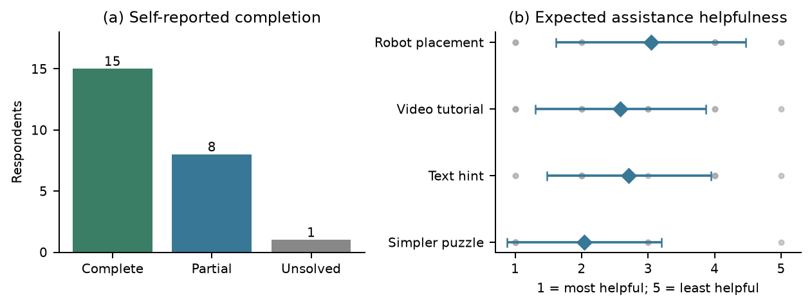
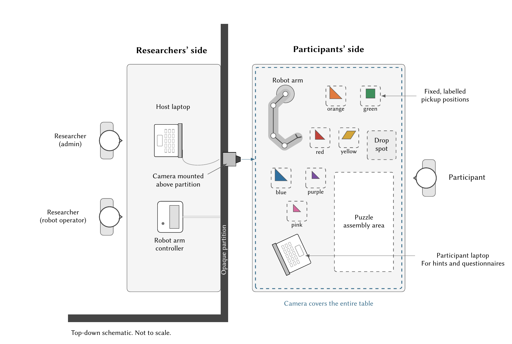
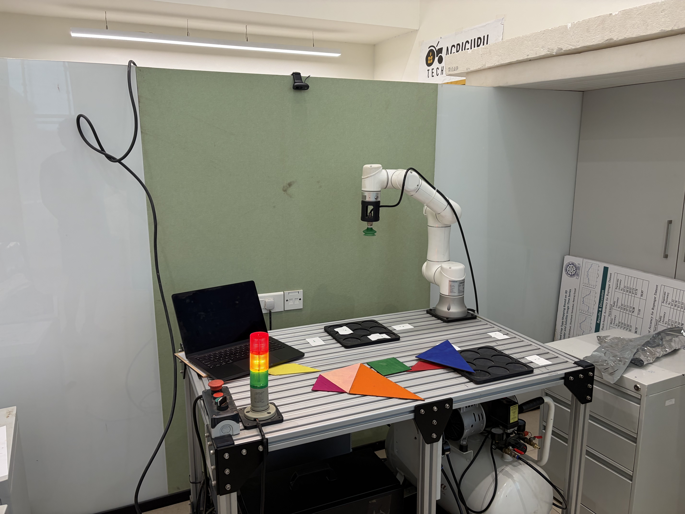
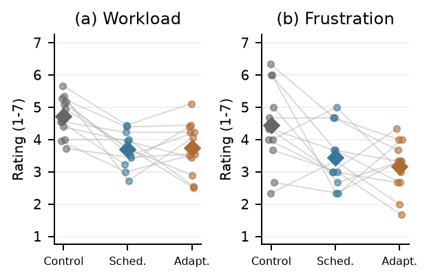
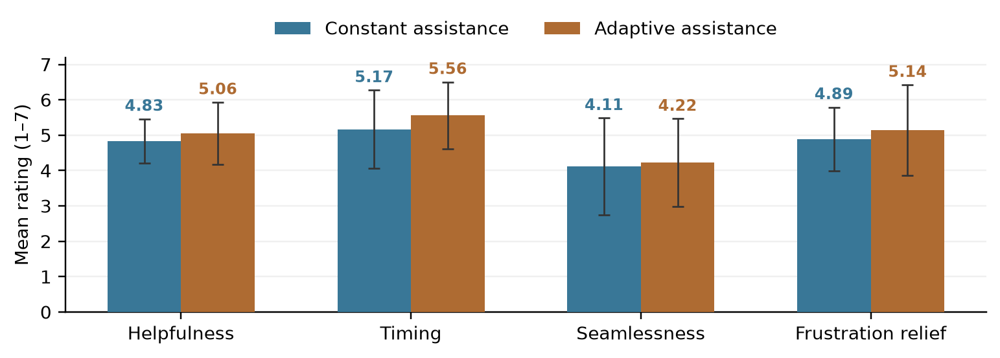

# When to Intervene: Trade-offs Between Constant and Physiology-Triggered Robotic Assistance

Anonymous Author(s)

Submission number: 2613

**WORKING DRAFT: N = 24 IS THE PLANNED SAMPLE. RESULTS AND DEMOGRAPHICS AWAIT FINAL UPDATE.**

## Abstract

In human–robot interaction (HRI), deciding when to provide assistance requires understanding how different intervention strategies affect both task performance and the user experience. Previous work has compared physiology-triggered robotic assistance with periodic support in surgical training. We extend this work to physical spatial problem solving by conducting an experiment to compare three conditions: no assistance, constant assistance, and adaptive assistance based on physiological signals. Twenty-four participants (N = 24) solve nine physical tangram puzzles across three sessions. The order of the conditions is varied across participants, and puzzles are randomly assigned to the sessions. Tangrams combine spatial reasoning with physical manipulation, providing a simple task for studying informational and physical assistance. Participants receive on-screen hints and robotic-arm interventions through a Wizard-of-Oz setup, with assistance offered every 30 seconds or adapted using heart-rate signals and task progress. We evaluate puzzle completion, completion time, workload, helpfulness, intervention timing, frustration, and trust. Both assistance conditions improve completion rates compared with no assistance; constant assistance achieves the highest completion and shortest duration, while adaptive assistance receives higher helpfulness and timing ratings and lower frustration. Together, these findings highlight distinct trade-offs between assistance strategies in task performance and user experience, providing insights for designing HRI systems that adapt assistance to the needs of the user.

## 1. Introduction

A person solving a physical puzzle may pause to mentally rotate a piece, reconsider an arrangement, or decide what to try next. These moments can look similar to an observer but call for different responses. A hint may help someone resume work; the same hint during a productive pause may interrupt a solution they were about to reach. For an assistive robot, deciding when to act is therefore part of deciding how to help.

Recent human-robot collaboration research makes assistance contingent on the person's activity. Andriella et al. model assistance type, timing, and confidence [1], while PACE uses action-completion estimates to coordinate proactive assistance [4]. A recent review distinguishes adaptation of robot motion from task-level decisions about timing, sequencing, and role allocation [7]. These approaches raise an evaluation question: does a strategy that supports task execution also provide help that people experience as appropriate?

Physiological signals offer another basis for assistance timing. Yang et al. compared workload-adaptive robotic suction with periodic support during surgical training [19]. We extend this comparison to physical spatial problem solving, where a hint can change a person's understanding of an arrangement and robotic assistance can change the availability of a piece. Our focus is the relationship between task performance and the experience of receiving these interventions.

We use seven-piece tangram puzzles to study this relationship. Recent work uses tangrams for collaborative HRI and as a simplified assembly task [15, 9]. They support repeated attempts with common materials, observable completion outcomes, and both informational and physical assistance. We compare assistance offered at regular intervals with assistance offered when physiological monitoring flags arousal, allowing the timing policy to respond to changes during the task.

Each participant experiences no assistance, constant assistance, and adaptive assistance, with three different puzzles per condition. Constant assistance is offered every 30 seconds; adaptive assistance is offered whenever arousal is flagged. A Wizard-of-Oz setup delivers the corresponding hints and robot actions. We assess both puzzle performance and participant experience to understand how the two assistance policies support progress and how their interventions are received.

We address two research questions. **RQ1:** How do the three assistance conditions differ in puzzle completion and round duration? **RQ2:** How do they differ in perceived workload and frustration, and how do the assisted conditions compare in helpfulness and intervention timing?

Our contributions are:

1. An extension of physiology-triggered versus periodic robotic assistance from surgical training to physical spatial problem solving, comparing constant and adaptive assistance with an unassisted condition using common text hints and piece retrieval.
2. Evidence that both assistance policies improve completion and reduce overall workload relative to no assistance, with constant assistance achieving the highest completion rate and shortest mean round duration.
3. A comparison of intervention experience showing higher mean helpfulness and timing ratings and lower mean frustration under adaptive assistance, alongside individual increases in frustration and no statistically significant differences between the assisted policies.
4. Participant feedback identifying the value of informational hints and the limits of piece retrieval, motivating physical assistance that supports placement within the target arrangement.

## 2. Related Work

### 2.1. Assistance timing and proactive coordination

Karbouj et al.'s review of adaptive industrial HRC distinguishes motion, task, and control adaptations and identifies task-level timing and coordination as areas warranting further attention [7]. Assistance timing is thus part of a broader design space in which robots adapt their motion, task contributions, and coordination with people.

Andriella et al. learn proactive assistance from user profiles and task state in a sequential memory game, jointly addressing assistance type, timing, and confidence [1]. PACE estimates action completion from hand movements and uses a learned policy to coordinate assistance during collaborative assembly [4]. PACE also compares proactive assistance with an explicit-query condition in which participants press a button to request help; participant waiting times were longest under explicit query [4]. These approaches connect robot behavior to unfolding human activity.

Ramnauth et al. model the appropriateness of robot assistance through its utility and costs to the recipient, relative human and robot skills, and task parallelizability. Their online study with 215 participants evaluates judgments about assistance in task vignettes rather than the effects of live interventions [21].

Lavit Nicora et al. analyze gaze during collaborative assembly with 37 participants and implement gaze-based initiation in a subsequent pilot with 10 volunteers. They treat gaze as a cue of readiness for joint activity [22]. This provides a behavioral approach to coordination alongside physiological triggering.

Tanneberg et al.'s Attentive Support combines scene information and dialogue with large language model reasoning to decide whether to assist a group or remain silent. Evaluation uses constructed scenarios and a robot demonstration rather than a comparative participant study [23].

In a separate memory-game study, Andriella et al. combine Q-learning with a heuristic mentalising layer that uses the player's history to select and explain hints. Their exploratory study with 56 participants reports better performance and greater acceptance, but explanations also differ between conditions and intervention timing remains fixed [24].

Vitry et al. compare proactive and reactive robot interaction in an escape-room task with 56 analyzed participants working in 28 pairs. Proactivity increases interaction but does not produce a significant overall task-performance difference; scheduled hints are provided in both conditions [25]. This distinction motivates evaluating intervention experience alongside completion and duration.

Candon et al. study verbal feedback reminders during continuous Space Invaders collaboration with 71 participants. Reminders before a change in robot behavior elicit faster feedback and more feedback in the following ten seconds, but timing does not significantly affect the feedback rate across whole games [31]. The study concerns soliciting feedback rather than offering task assistance.

Cao et al. classify and respond to user-initiated interruptions in a conversational robot. Their study with 21 participants uses timed decision-making and contentious discussion tasks; exploratory analyses associate unsuccessful interruption handling with lower perceived inclusion and discussion satisfaction [32]. These findings concern responding to the user's interruptions, complementing the question of when a robot should initiate assistance.

Our study examines fixed-interval and arousal-triggered assistance in a physical reasoning task, considering both task outcomes and the experience of the intervention.

### 2.2. Physiological information in assistance

Yang et al.'s surgical system uses EEG and eye tracking to inform adaptive suction, with a periodic comparator selected to approximate earlier observed assistance frequency [19]. Earlier work by Teo et al. uses individualized physiological workload markers to trigger aid during robot supervision, imposing aid later when it has not been triggered [16]. These studies establish approaches to physiological assistance timing across tasks with different demands, sensors, and forms of support.

Other work integrates physiological measurement with broader adaptation strategies. Hostettler et al. adapt robot behavior to user distance while measuring pupil responses; direct pupil-driven adaptation is a future direction [6]. Ojsteršek et al. personalize robot parameters using a preliminary skills test and analyze ECG recordings after the experiment [10]. Korivand et al. develop physiological task-load prediction and Q-learning-based adjustment, while explicitly reporting that their recorded wristband data could not be integrated directly for real-time use [8]. Together, these studies illustrate how physiological measurements can support evaluation, personalization, and intervention timing.

Recent systems extend physiological adaptation beyond robotic task execution. GuideAI combines cardiac, gaze, and behavioral information to adapt learning content, pacing, and feedback [13]. In a single-surgeon simulation study, Wei et al. identify subjective workload and mean heart rate among the influential features in a task-performance prediction model [18]. These findings motivate examining physiology alongside reported experience, while their tasks and inference methods differ from our assistance policy.

Prajod et al. examine ECG-derived heart-rate variability and facial-expression estimates under different robot pacing conditions in collaborative assembly. Their perceived-challenge classifier is evaluated offline, and the adaptive condition uses Wizard-of-Oz judgments of task progress rather than physiological triggers [26].

Bhagat Smith and Adams review workload estimation for unknown tasks, emphasizing that the relevance of physiological signals can change across tasks and individuals. They assess machine learning approaches by portability, model complexity, and adaptability, and identify domain generalization and few-shot learning as promising directions requiring further empirical investigation [33].

Pereira et al.'s review documents heterogeneous workload measures and mixed cardiac findings across HRC studies [11]. Capponi et al. similarly find no clear RMSSD pattern across their assembly configurations and distinguish cognitive effort from stress [3]. Cardiac measurement guidelines distinguish heart rate from beat-to-beat variability and emphasize signal quality and the influence of physical activity on wearable measurements [12]. We therefore evaluate arousal-triggered assistance through its effects on task performance and participant experience, alongside the physiological signal used to initiate it.

### 2.3. Physical tasks and participant experience

Tabatabaei et al. study gaze around robot failures during collaborative tangram solving [15]. SensCogAR uses tangrams as a proxy for small-object assembly, manipulating the visibility of piece contours to vary task demand [9]. Adjacent assembly work by Caiazzo et al. compares manual, collaborative, and guided collaborative conditions, with EEG used for workload assessment [2]. MRChaos uses tangrams to investigate robotic reasoning, planning, and manipulation from silhouette targets and extends its assembly approach to cutlery and soda-can arrangements [20]. These task settings combine spatial interpretation, manipulation, and interaction with robot assistance.

Cavicchi et al.'s narrative review of humanoid robots in cognitive-conflict tasks cautions that social cues can distract as well as support performance and recommends delegating parts of the main task to enable cognitive offloading [27]. This perspective motivates distinguishing the informational and physical contributions of assistance.

In an assembly study with 20 participants, van Dijk et al. report lower scores on five workload dimensions under human-led collaboration and lower mental and temporal demand with slower robot pacing. Pacing changes action onset while robot movement speed remains constant [28].

Varrasi et al. compare human and robot guidance in a modified Trail Making Test with 60 younger and older adults. Older adults report greater workload under robot than human assistance, whereas the corresponding difference in younger adults is not significant [29]. This highlights the importance of participant population when evaluating guidance.

In supply-chain operations, Smit et al. model collaborative human-robot order picking and jointly optimize picking efficiency and workload fairness through simulation [14]. This work highlights the importance of evaluating human demands alongside system performance when extending assistance to logistics.

In a medical-training simulation with 84 participants, Tanjim et al. use a Wizard-of-Oz robotic crash cart to compare speech and light cues for object search and medication reminders. Verbal object-search guidance with visual reminders yields lower reported workload and higher perceived usefulness and ease of use than the reversed cue assignment or no feedback [34]. This comparison concerns assistance format rather than physiological triggering.

Hart describes the six NASA-TLX workload dimensions and the use of an unweighted overall score [5]. We assess these dimensions alongside helpfulness, timing, seamlessness, and frustration relief. This combination connects the demands of solving a puzzle with the participant's experience of the assistance itself.

### 2.4. Wizard-of-Oz evaluation

Wizard-of-Oz methods support the study of robot interactions through human-operated delivery. A recent HRI workshop proposal by Thunberg et al. emphasizes the practical, ethical, and methodological tensions of the wizard's role [17].

Bejarano et al.'s interviews with six HRI researchers identify challenges involving operator response processing, robot delays, unpredictable participants, and control precision [30]. These findings make operator delivery and interface constraints relevant to interpreting Wizard-of-Oz interactions.

In our setup, the condition determines when assistance is offered: every 30 seconds or when arousal is flagged. The researcher delivers a task-relevant hint or robot cue, and the robot operator executes the corresponding program. This arrangement supports the comparison of timing policies using a common assistance interface.

## 3. Formative Assessment of Tangram Solving

### 3.1. Assessment procedure and task experience

A formative assessment collected responses from 24 people: 22 undergraduate students, one graduate student, and one faculty member. Respondents were aged 18–30 years (M=20.17, SD=2.24); 14 identified as men, nine as women, and one preferred not to disclose gender. Respondents were recruited through forms shared on college mailing groups. A Google Form linked to an online square tangram with a timer; respondents attempted the puzzle and reported their familiarity, completion, solving time, and moments of uncertainty. They also rated the assistance they would find helpful if stuck. Some respondents also participated in the robot experiment.

Twelve respondents had previously solved tangrams, including two who solved them regularly. Seven had heard of tangrams without solving them, and five were unfamiliar with them. Fifteen respondents reported completing the puzzle (62.5%), eight reported partial completion (33.3%), and one did not solve it (4.2%). Seventeen respondents (70.8%) reported feeling stuck at least once. Twelve selected a solving time below one minute, eight selected one to five minutes, and two selected five to ten minutes; two selected the option for not attempting or solving the puzzle.

### 3.2. Assistance expectations and task rationale

Respondents independently rated four hypothetical forms of assistance on scales from 1 (most helpful) to 5 (least helpful). A simpler puzzle received a mean rating of 2.04 (SD=1.16), a step-by-step video tutorial 2.58 (SD=1.28), a text hint 2.71 (SD=1.23), and a robot physically showing where to place a piece 3.04 (SD=1.43; Figure 1). Written responses requested help with the first piece, visual guidance about piece placement, and hints at moments of difficulty. None of the six pairwise expected-helpfulness differences was statistically significant after correction (p≥ .102). These expectations contextualize the main experiment's comparison of informational and physical assistance.

*Figure 1. Formative assessment (N=24). Left: self-reported puzzle outcomes. Right: expected helpfulness of four independently rated assistance options; diamonds show means, bars show SD, and gray dots show individual ratings. Lower ratings indicate greater expected helpfulness.*

Each experimental tangram requires all seven pieces to reproduce a target shape: two large triangles, one medium triangle, two small triangles, a square, and a parallelogram. The seven colored pieces together form a 10×10-inch square. Their colors provide consistent references for hints and robot actions. We use nine targets, each with a solution available to the researcher.

Tangrams combine spatial reasoning with physical manipulation. Participants interpret the target, identify useful piece relationships, and test arrangements by moving and rotating the pieces. Informational assistance can address orientation or adjacency, while the arm can bring a relevant piece into the workspace. Different targets retain common materials and instructions, supporting repeated comparisons across conditions. Participants can revisit placements and work on different regions of the target rather than following a single prescribed sequence. The current arrangement guides assistance content, while the assigned condition determines its timing.

## 4. Study Method: Assistance System and Experimental Protocol

### 4.1. Architecture and apparatus

Our system coordinates three browser interfaces through a local server (Figure 2). The researcher dashboard displays the puzzle solution, workspace camera view, timer, physiological feedback, and assistance controls. The participant laptop presents instructions, text hints, the timer, and questionnaires. The robot-operator display identifies the piece-specific program to execute. The server synchronizes the interfaces and records task outcomes, interventions, and questionnaire responses.

*Figure 2. Assistance architecture. Cardiac measurements pass through signal-quality checks and a heart-rate-rise detector. The assigned condition determines assistance timing; task context guides the researcher’s selection of hints and robot actions. The local server synchronizes interfaces and records study measures.*

The setup combines an Orangewood robotic arm, a Maxim H Band wrist sensor, and a Logitech C270 workspace camera. An opaque partition separates the participant from two researchers, who administer the task and operate the arm (Figure 3). The camera is mounted on top of the partition and covers the participant table. The participant faces a workspace with a puzzle assembly area in front of and to their left, a drop spot to their right, and a laptop for hints and questionnaires. Unused pieces occupy fixed, labeled pickup positions. The arm retrieves a selected piece using one of seven piece-specific programs and delivers it to the drop spot; the participant places it in the target arrangement. Preset text hints describe piece location, orientation, or adjacency, providing consistent assistance content across participants. Hints are accompanied by an audible notification. The researcher selects either a hint alone or a robot action paired with a hint, based on the current arrangement.

*Figure 3. Wizard-of-Oz setup, with a top-down schematic and a photograph of the apparatus at upper right. An opaque partition separates the researchers from the participant; a camera mounted on the partition observes the participant table. The table contains fixed piece pickup positions, the robot drop spot, the assembly area, and the participant laptop. Schematic not to scale.*

**ADD ROBOT AND PIECE MATERIAL DETAILS**

### 4.2. Physiological monitoring

After receiving the study information, participants wore the wrist sensor during a three-minute pre-task baseline window. The sensor streams cardiac measurements over Bluetooth to a Python collector. To detect a short-term rise in heart rate, the collector compares median heart rate over the latest 15 seconds with median heart rate over the preceding 60 seconds. The arousal flag is raised when the difference is at least 5 beats per minute. A calibrated baseline provides the reference while the rolling reference is being established. Signal-quality checks exclude out-of-range readings and readings with poor sensor contact, and the detector requires sufficient usable samples before raising a flag.

The dashboard displays the flag alongside the workspace view. In the adaptive condition, the flag initiates assistance, while the puzzle arrangement determines the content of the hint or robot action. The flag is a heart-rate-rise cue for assistance timing; participant workload and frustration are assessed through questionnaires.

### 4.3. Assistance conditions

**No assistance.** Participants solve the puzzle without text hints or robotic-arm assistance.

**Constant assistance.** Assistance is offered every 30 seconds during the puzzle. At each interval, the researcher delivers a preset text hint or a robotic-arm intervention accompanied by a hint, relevant to the current arrangement.

**Physiology-informed adaptive assistance.** Assistance is offered whenever physiological monitoring flags arousal. The researcher delivers a preset text hint or a robotic-arm intervention accompanied by a hint, relevant to the current arrangement. Repeated flags prompt additional assistance. When a flag recurs rapidly or remains raised, the researcher waits 15 seconds before the next intervention. The arousal flag determines when help is offered; the task state guides the researcher’s choice of assistance content.

### 4.4. Participants and procedure

The study targets twenty-four participants (N=24). Participants volunteered through forms shared in college groups and received coupons as compensation. Each completed three sessions of three puzzles, with one assistance condition per session. Condition order varied across participants, and puzzles were randomly assigned to sessions. Participants provided consent and background information before beginning the task. A puzzle was judged solved when the arrangement resembled the target shape using all seven pieces. Unsolved attempts were stopped at five minutes. Each puzzle was followed by a questionnaire, with five-minute breaks between sessions and an overall questionnaire after the ninth puzzle.

**INSERT FINAL DEMOGRAPHICS / ADD ELIGIBILITY AND PRACTICE DETAILS**

### 4.5. Measures and analysis

We measure puzzle completion and pause-adjusted round duration, including both solved and unsolved attempts. After each puzzle, participants rate the six NASA-TLX dimensions on seven-point scales: mental demand, physical demand, temporal demand, performance, effort, and frustration. An overall workload score averages the six items after aligning their direction so that higher values indicate greater workload. After assisted puzzles, participants also rate helpfulness, timing, seamlessness, and frustration relief. The final questionnaire assesses overall helpfulness, efficacy, trust, and reliance on the robot's guidance.

For photograph-based partial-progress scoring, we count correctly placed pieces against the target arrangement. If a partial solution admits two possible orientations, we retain the orientation with more correctly placed pieces.

We average ratings and durations across each participant's three trials per condition, then report means and standard deviations across participants. Completion is reported as the proportion of puzzles solved. Exploratory pairwise comparisons use two-sided paired sign-flip tests on participant-condition averages. Holm correction is applied to the three comparisons for each outcome and to the four assistance-rating comparisons; reported p values are adjusted, with α=.05. The six formative-assessment rating comparisons form a separate Holm-corrected family.

## 5. Findings

**UPDATE WITH FINAL RESULTS**

### 5.1. Task performance

**INSERT CORRECT PIECE COUNT / CONFIRM PLACEMENT TOLERANCE AND SCORERS**

Participants solved 47 of 108 puzzles. Completion rates were 13.9% without assistance, 66.7% with constant assistance, and 50.0% with adaptive assistance (Table 1). Compared with control, completion was 52.8 percentage points higher with constant assistance (p=.0015) and 36.1 points higher with adaptive assistance (p=.016). The difference between the two assisted conditions was not statistically significant (p=.156).

| Condition | Solved | Rate | Duration (s) |
| –- | –- | –- | –- |
| Control | 5/36 | 13.9% | 289.58 (25.59) |
| Constant | **24/36** | **66.7%** | **239.03 (51.42)** |
| Adaptive | 18/36 | 50.0% | 268.78 (30.30) |

*Table 1. Puzzle completion and round duration. Duration includes all attempts; values are mean (SD) across participant-condition averages. Bold marks the highest completion and shortest duration.*

Constant assistance also had the shortest mean round duration. Its mean was 50.56 seconds below control (p=.012). The adaptive-control and adaptive-constant duration differences were not statistically significant (both p=.132). These durations summarize time spent across all attempts, rather than time to successful completion alone.

### 5.2. Subjective workload

Overall workload averaged 4.72 in control, 3.69 with constant assistance, and 3.74 with adaptive assistance (Table 2; Figure 4). Both assisted conditions had lower workload than control: the mean reductions were 1.03 points for constant assistance (p=.0020) and 0.98 points for adaptive assistance (p=.0015). Their overall workload scores did not differ significantly (p=.882).

| Measure | Control | Constant | Adaptive | p (C–N) | p (A–N) | p (A–C) |
| –- | –- | –- | –- | –- | –- | –- |
| Mental demand | 5.83 (0.96) | **4.69 (0.90)** | 4.81 (1.40) | .006 | .012 | .826 |
| Physical demand | 3.64 (1.63) | **3.11 (1.28)** | 3.28 (1.50) | .211 | .563 | .652 |
| Temporal demand | 3.94 (1.27) | **3.33 (0.88)** | 3.44 (1.34) | .088 | .131 | .801 |
| Perceived performance | 3.08 (1.51) | 5.03 (1.05) | **5.06 (1.25)** | .002 | .0015 | 1.000 |
| Effort | 5.56 (0.67) | **4.61 (0.91)** | 4.81 (1.08) | .015 | .037 | .473 |
| Frustration | 4.44 (1.26) | 3.44 (0.91) | **3.17 (0.81)** | .068 | .031 | .470 |
| Overall workload | 4.72 (0.62) | **3.69 (0.54)** | 3.74 (0.81) | .002 | .0015 | .882 |

*Table 2. NASA-TLX dimension ratings and overall workload on seven-point scales, mean (SD). Higher performance ratings indicate greater success; higher workload ratings indicate greater demand. Bold marks the most favorable mean in each row, independently of significance. Adjusted pairwise p values compare constant with control (C–N), adaptive with control (A–N), and adaptive with constant (A–C).*

Both assisted conditions reduced mental demand and effort and increased perceived performance relative to control (Table 2). Physical and temporal demand did not differ significantly across the paired comparisons. Adaptive assistance reduced frustration relative to control (p=.031), while the constant-control difference was not significant (p=.068). None of the workload dimensions differed significantly between constant and adaptive assistance.

Mean frustration was lower with adaptive assistance than with constant assistance (3.17 versus 3.44), but individual responses varied: some participants reported greater frustration under adaptive assistance. The paired plot shows this variation alongside the group means (Figure 4).

*Figure 4. Overall workload and frustration. Lines connect each participant's condition averages; diamonds show condition means. Higher values indicate greater burden.*

### 5.3. Intervention experience

Adaptive assistance received higher mean ratings on all four assistance-specific items (Table 3; Figure 5). Helpfulness averaged 5.06 with adaptive assistance and 4.83 with constant assistance; timing averaged 5.56 and 5.17, respectively. Mean seamlessness was 4.22 versus 4.11, and frustration relief was 5.14 versus 4.89. None of these paired differences was statistically significant after correction (timing p=.719; other items p=1.000).

| Measure | Constant | Adaptive |
| –- | –- | –- |
| Helpfulness | 4.83 (0.63) | **5.06 (0.87)** |
| Timing | 5.17 (1.11) | **5.56 (0.95)** |
| Seamlessness | 4.11 (1.37) | **4.22 (1.24)** |
| Frustration relief | 4.89 (0.90) | **5.14 (1.28)** |

*Table 3. Intervention experience in the two assisted conditions, mean (SD). Higher ratings indicate a more favorable experience; bold marks the highest mean in each row.*

These ratings describe the combined experience of text hints and robotic-arm assistance. The higher adaptive averages alongside lower completion than constant assistance motivate examining both task progress and the experience of receiving help.

*Figure 5. Assistance ratings for constant and adaptive assistance. Bars show means across participant-condition averages; error bars show one standard deviation. Labels give the mean ratings on the seven-point scale. Higher ratings indicate a more favorable experience.*

### 5.4. Overall experience

Overall helpfulness averaged 5.08 (SD=1.24), efficacy 4.92 (SD=1.51), and trust 4.75 (SD=1.60). Agreement with following the robot's guidance even when uncertain averaged 5.08 (SD=1.31). These end-of-study ratings summarize participants' experience across all three conditions.

Participant comments highlighted the importance of clear, timely hints and the role of physical assistance. P101 requested *“need better worded hints”* while noting that the task *“has the potential to be fun and challenging.”* P103 wrote, *“The hints were helpful and overall well timed, but the actual robot arm moving the pieces were not adding anything more”*. These remarks suggest that participants valued guidance for solving the puzzle while questioning the additional benefit of piece retrieval.

## 6. Discussion, Limitations, and Future Work

### 6.1. Task progress and the experience of assistance

Both assistance conditions increased completion and reduced overall workload relative to control. Constant assistance had the highest completion rate and shortest mean round duration. Adaptive assistance received higher average helpfulness and timing ratings and lower average frustration, but these differences between the assisted conditions were not statistically significant. The findings support considering performance and participant experience together without establishing that either assisted policy is consistently preferable.

Regular assistance may provide opportunities to reconsider an arrangement and advance the puzzle. Arousal-triggered assistance may concentrate help at moments when participants are receptive to it. The formative assessment similarly showed that respondents could feel stuck despite completing the puzzle and requested guidance about specific placements. These interpretations motivate testing how assistance matches the stage of a solution process.

### 6.2. Assistance timing and physiological feedback

The adaptive policy links intervention timing to arousal events, while constant assistance provides predictable assistance opportunities. In a spatial reasoning task, participants alternate between manipulation and reflection, so usefulness can depend on when help arrives. The researchers observed participants waiting for assistance at times. Participants were not informed of the adaptive trigger rules, so they could expect help during a difficult pause even when no arousal flag was raised. A mismatch between expected and delivered assistance could help explain why frustration increased for some participants despite its lower group mean. This interpretation is based on observation; the present measures do not establish the cause of these increases. Future work could relate arousal events and intervention times to observed puzzle progress and evaluate which assistance content is most useful at different stages. The heart-rate-rise cue also warrants validation against task events and independent physiological measurements. Wearable cardiac signals can be affected by movement and sensor contact [12], making these checks particularly relevant during physical manipulation. Comparisons across tasks and sensors would help establish how broadly the timing policy applies.

### 6.3. Limitations and future work

Participant feedback suggested that hints were more important for solving the puzzle than robot retrieval. P103 noted that *“the arm took time in moving the piece which cut into solving time”*. Although retrieval makes a piece available, the participant still determines its placement. Future work could have the robot place pieces directly in the target arrangement and examine whether this increases the value of physical assistance.

The observation of waiting was not systematically coded, so its prevalence and relationship to frustration remain unresolved. A future comparison could explain the adaptive rules or allow participants to request help directly, examining whether greater control improves the experience without delaying useful support. PACE found longer participant waiting times under explicit query than under proactive assistance [4]; requesting help therefore warrants evaluation in the context of the task rather than assuming it will be preferable.

Experience ratings combined text and robotic-arm assistance. Future comparisons should examine each modality separately. Correct-piece scoring from final photographs would provide a finer measure of partial progress alongside binary completion. The formative assessment measured anticipated helpfulness, whereas the experiment measured experience after receiving assistance; these ratings address different questions.

The seven-point workload ratings and overall trust item capture participants' reported experience. Trust was measured after all conditions, so condition-specific changes require further study. Tangrams provide a controlled spatial task.

Tangrams share part selection, orientation, and placement demands with assembly, while piece retrieval resembles material provision in collaborative picking. MRChaos demonstrates related spatial assembly tasks [20], and human-robot order-picking research examines efficiency alongside workload fairness [14]. These connections motivate testing assistance timing in assembly and logistics with their own workflow, safety, and precision requirements; the present results do not establish transfer to those settings.

## 7. Ethical Considerations

Participants consented through the volunteer form and again before the experiment. The interface required consent and acknowledgement of instructions before the task began. Participation was voluntary, with the option to pause or stop without penalty. Participants consented to workspace recording and live viewing; the camera showed only the table and hands, excluding faces. Cardiac measurements and questionnaire responses were also collected.

The concealed human operation in the Wizard-of-Oz setup was not disclosed during or after the task. Participant codes link the records; data release must respect consent coverage and protect identifying information.

**ADD ETHICS APPROVAL OR EXEMPTION DETAILS**

## 8. Conclusion

We compared unassisted, constant, and physiology-informed adaptive assistance for physical tangram solving. Both assisted conditions improved completion and reduced workload relative to control. Constant assistance had the highest observed completion rate and shortest mean round duration. Adaptive assistance received higher average intervention ratings and lower frustration, with no statistically significant differences between the assisted conditions. These findings motivate systems that consider both task progress and the experience of receiving help, alongside further study of the content and physical role of assistance.

## AI Assistance Disclosure

AI-assisted tools were used in preparing this manuscript. The authors are responsible for the accuracy, originality, and integrity of the work, including its citations.

## References

[1] Antonio Andriella, Ilenia Cucciniello, Antonio Origlia, Silvia Rossi. 2025. [A Bayesian framework for learning proactive robot behaviour in assistive tasks](https://doi.org/10.1007/s11257-024-09421-1). *User Modeling and User-Adapted Interaction 35(1), 1*.

[2] Carlo Caiazzo, Marija Savkovic, Milos Pusica, Nastasija Nikolic, Ivan Macuzic, Marko Djapan. 2024. [Comparative Analysis Of Mental Workload In Adaptive Human-Robot Collaboration During Assembly Tasks](https://scidar.kg.ac.rs/handle/123456789/21811). *Advances in Reliability, Safety and Security, Part 5 (ESREL 2024)*.

[3] Matteo Capponi, Riccardo Gervasi, Luca Mastrogiacomo, Fiorenzo Franceschini. 2024. [Assembly complexity and physiological response in human-robot collaboration: Insights from a preliminary experimental analysis](https://doi.org/10.1016/j.rcim.2024.102789). *Robotics and Computer-Integrated Manufacturing 89, 102789*.

[4] Davide De Lazzari, Matteo Terreran, Giulio Giacomuzzo, Siddarth Jain, Pietro Falco, Ruggero Carli, Diego Romeres. 2025. [PACE: Proactive Assistance in Human-Robot Collaboration through Action-Completion Estimation](https://doi.org/10.1109/ICRA55743.2025.11127399). *2025 IEEE International Conference on Robotics and Automation (ICRA)*.

[5] Sandra G. Hart. 2006. [NASA-Task Load Index (NASA-TLX); 20 Years Later](https://doi.org/10.1177/154193120605000909). *Proceedings of the Human Factors and Ergonomics Society Annual Meeting 50(9)*.

[6] Damian Hostettler, Simon Mayer, Jan Liam Albert, Kay Erik Jenss, Christian Hildebrand. 2025. [Real-Time Adaptive Industrial Robots: Improving Safety And Comfort In Human-Robot Collaboration](https://doi.org/10.1145/3706598.3713889). *Proceedings of the 2025 CHI Conference on Human Factors in Computing Systems, 1–16*.

[7] Bsher Karbouj, Rajwinder Garha, Konstantin Keßler, Jörg Krüger. 2026. [Adaptive Robotic Behavior in Industrial Human–Robot Collaboration: A Systematic Review of Taxonomies, Enabling Mechanisms, and Research Frontiers](https://doi.org/10.1109/access.2025.3649702). *IEEE Access 14, 1398–1422*.

[8] Soroush Korivand, Gustavo Galvani, Arash Ajoudani, Jiaqi Gong, Nader Jalili. 2024. [Optimizing Human–Robot Teaming Performance through Q-Learning-Based Task Load Adjustment and Physiological Data Analysis](https://doi.org/10.3390/s24092817). *Sensors 24(9), 2817*.

[9] Javier Melo, Leyla Akinci, Ko Watanabe, Nicolas Großmann, Shoya Ishimaru, Andreas Dengel. 2026. [SensCogAR: Cognitive Load Estimation Via Movement Data in Assembly Tasks](https://doi.org/10.60401/ijabc.147). *International Journal of Activity and Behavior Computing 2026(1), 1–20*.

[10] Robert Ojsteršek, Borut Buchmeister, Aljaž Javernik. 2024. [Personalizing Human–Robot Workplace Parameters in Human-Centered Manufacturing](https://doi.org/10.3390/machines12080546). *Machines 12(8), 546*.

[11] Eduarda Pereira, Luis Sigcha, Emanuel Silva, Adriana Sampaio, Nuno Costa, Nélson Costa. 2025. [Capturing Mental Workload Through Physiological Sensors in Human–Robot Collaboration: A Systematic Literature Review](https://doi.org/10.3390/app15063317). *Applied Sciences 15(6), 3317*.

[12] Karen S. Quigley, Peter J. Gianaros, Greg J. Norman, J. Richard Jennings, Gary G. Berntson, Eco J. C. de Geus. 2024. [Publication guidelines for human heart rate and heart rate variability studies in psychophysiology: Part 1: Physiological underpinnings and foundations of measurement](https://doi.org/10.1111/psyp.14604). *Psychophysiology 61, e14604*.

[13] Ananya Shukla, Chaitanya Modi, Satvik Bajpai, Siddharth Siddharth. 2026. [GuideAI: A Real-time Personalized Learning Solution with Adaptive Interventions](https://doi.org/10.1145/3742413.3789125). *31st International Conference on Intelligent User Interfaces (IUI 2026)*.

[14] Igor G. Smit, Zaharah Bukhsh, Mykola Pechenizkiy, Kostas Alogariastos, Kasper Hendriks, Yingqian Zhang. 2024. [Learning Efficient and Fair Policies for Uncertainty-Aware Collaborative Human-Robot Order Picking](https://arxiv.org/abs/2404.08006). *arXiv:2404.08006, reviewed v1 preprint*.

[15] Ramtin Tabatabaei, Vassilis Kostakos, Wafa Johal. 2025. [Gazing at Failure: Investigating Human Gaze in Response to Robot Failure in Collaborative Tasks](https://doi.org/10.1109/hri61500.2025.10973935). *2025 20th ACM/IEEE International Conference on Human-Robot Interaction (HRI), 939–948*.

[16] Grace Teo, Lauren Reinerman-Jones, Gerald Matthews, James Szalma, Florian Jentsch, Peter Hancock. 2018. [Enhancing the effectiveness of human-robot teaming with a closed-loop system](https://doi.org/10.1016/j.apergo.2017.07.007). *Applied Ergonomics 67, 91–103*. First published online 3 October 2017.

[17] Sofia Thunberg, Mafalda Gamboa, Meagan B. Loerakker, Patricia Alves-Oliveira, Hannah R. M. Pelikan. 2026. [Unpacking Lived Experiences of Wizards of Oz](https://doi.org/10.1145/3776734.3788834). *Companion Proceedings of the 21st ACM/IEEE International Conference on Human-Robot Interaction, 1399–1401*. Workshop proposal.

[18] Kaiqi Wei, Chika Kimura, Megumi Shimura, Yoshihiro Shimomura, Xue Zhao, Takaaki Tamura, Shinichi Sakamoto. 2025. [Predicting task performance in robot-assisted surgery using physiological stress and subjective workload: a case study with interpretable machine learning](https://doi.org/10.3389/fnhum.2025.1611524). *Frontiers in Human Neuroscience 19, 1611524*.

[19] Jing Yang, Juan Antonio Barragan, Jason Michael Farrow, Chandru P. Sundaram, Juan P. Wachs, Denny Yu. 2024. [An Adaptive Human-Robotic Interaction Architecture for Augmenting Surgery Performance Using Real-Time Workload Sensing—Demonstration of a Semi-autonomous Suction Tool](https://doi.org/10.1177/00187208221129940). *Human Factors: The Journal of the Human Factors and Ergonomics Society 66(4), 1081–1102*. First published online 11 November 2022; journal issue April 2024.

[20] Chao Zhao, Chunli Jiang, Lifan Luo, Guanlan Zhang, Hongyu Yu, Michael Yu Wang, Qifeng Chen. 2025. [Master Rules from Chaos: Learning to Reason, Plan, and Interact from Chaos for Tangram Assembly](https://arxiv.org/abs/2505.11818). *ICRA 2025; reviewed accepted-paper preprint, arXiv v1*.

[21] Ramnauth, Rebecca; Brščić, Dražen; Scassellati, Brian. 2026. [To Help or Not to Help?: An Expanded Framework for Deciding Socially Appropriate Robot Assistance](https://doi.org/10.1145/3797264). *ACM Transactions on Human-Robot Interaction*.

[22] Lavit Nicora, Matteo; Prajod, Pooja; Mondellini, Marta; Tauro, Giovanni; Vertechy, Rocco; André, Elisabeth; Malosio, Matteo. 2024. [Gaze detection as a social cue to initiate natural human-robot collaboration in an assembly task](https://doi.org/10.3389/frobt.2024.1394379). *Frontiers in Robotics and AI*.

[23] Tanneberg, Daniel; Ocker, Felix; Hasler, Stephan; Deigmoeller, Joerg; Belardinelli, Anna; Wang, Chao; Wersing, Heiko; Sendhoff, Bernhard; Gienger, Michael. 2024. [To Help or Not to Help: LLM-based Attentive Support for Human-Robot Group Interactions](https://doi.org/10.1109/IROS58592.2024.10801517). *2024 IEEE/RSJ International Conference on Intelligent Robots and Systems (IROS)*.

[24] Andriella, Antonio; Falcone, Giovanni; Rossi, Silvia. 2025. [Enhancing Robot Assistive Behaviour by Mentalising User Intent and Beliefs with Reinforcement Learning](https://doi.org/10.1007/s12369-025-01280-z). *International Journal of Social Robotics*.

[25] Vitry, Thomas; Maeder, Vanessa; Edgeworth, Kieran; Hazaiti, Asihati; Ates, Doga Deniz; Gäde, Connor; Habekost, Jan-Gerrit; Becker, Dennis; Wermter, Stefan. 2026. [When May I Help You? On The Effect of Proactivity on Group Human-Robot Collaboration](https://ras.papercept.net/conferences/conferences/ROMAN26/program/ROMAN26_ContentListWeb_2.html). *2026 IEEE 35th International Conference on Robot and Human Interactive Communication (RO-MAN)*. Accessible conference author manuscript; IEEE archival DOI not yet verified.

[26] Prajod, Pooja; Lavit Nicora, Matteo; Mondellini, Marta; Meregalli Falerni, Matteo; Vertechy, Rocco; Malosio, Matteo; André, Elisabeth. 2024. [Flow in human-robot collaboration—multimodal analysis and perceived challenge detection in industrial scenarios](https://doi.org/10.3389/frobt.2024.1393795). *Frontiers in Robotics and AI*.

[27] Cavicchi, Shari; Abubshait, Abdulaziz; Siri, Giulia; Mustile, Magda; Ciardo, Francesca. 2025. [Can humanoid robots be used as a cognitive offloading tool?](https://doi.org/10.1186/s41235-025-00616-7). *Cognitive Research: Principles and Implications*.

[28] van Dijk, Wietse; Baltrusch, Saskia J.; Dessers, Ezra; de Looze, Michiel P.. 2023. [The effect of human autonomy and robot work pace on perceived workload in human-robot collaborative assembly work](https://doi.org/10.3389/frobt.2023.1244656). *Frontiers in Robotics and AI*.

[29] Varrasi, Simone; Vagnetti, Roberto; Camp, Nicola; Hough, John; Di Nuovo, Alessandro; Castellano, Sabrina; Magistro, Daniele. 2026. [Human and Robot Assistance for Cognitive Load in Younger and Older Adults: Multimodal Within-Subject Experimental Study](https://doi.org/10.2196/94738). *Journal of Medical Internet Research*.

[30] Bejarano, Alexandra; Elbeleidy, Saad; Mott, Terran; Negrete-Alamillo, Sebastian; Armenta, Luis Angel; Williams, Tom. 2024. [Hardships in the Land of Oz: Robot Control Challenges Faced by HRI Researchers and Real-World Teleoperators](https://doi.org/10.1109/RO-MAN60168.2024.10731251). *2024 IEEE 33rd International Conference on Robot and Human Interactive Communication (RO-MAN)*.

[31] Candon, Kate; Zhou, Helen; Gillet, Sarah; Vázquez, Marynel. 2023. [Verbally Soliciting Human Feedback in Continuous Human-Robot Collaboration: Effects of the Framing and Timing of Reminders](https://doi.org/10.1145/3568162.3576980). *Proceedings of the 2023 ACM/IEEE International Conference on Human-Robot Interaction, 290–300*.

[32] Cao, Shiye; Moon, Jiwon; Mahmood, Amama; Antony, Victor Nikhil; Xiao, Ziang; Liu, Anqi; Huang, Chien-Ming. 2025. [Interruption Handling for Conversational Robots](https://doi.org/10.15607/RSS.2025.XXI.089). *Proceedings of Robotics: Science and Systems XXI*.

[33] Bhagat Smith, Joshua; Adams, Julie A.. 2026. [A survey of machine learning for estimating workload: considering unknown tasks](https://doi.org/10.3389/frobt.2026.1872363). *Frontiers in Robotics and AI 13, 1872363*.

[34] Tanjim, Tauhid; St. George, Jonathan; Ching, Kevin; Taylor, Angelique. 2025. [Help or Hindrance: Understanding the Impact of Robot Communication in Action Teams](https://doi.org/10.1109/RO-MAN63969.2025.11217909). *2025 34th IEEE International Conference on Robot and Human Interactive Communication (RO-MAN), 1460–1465*.
